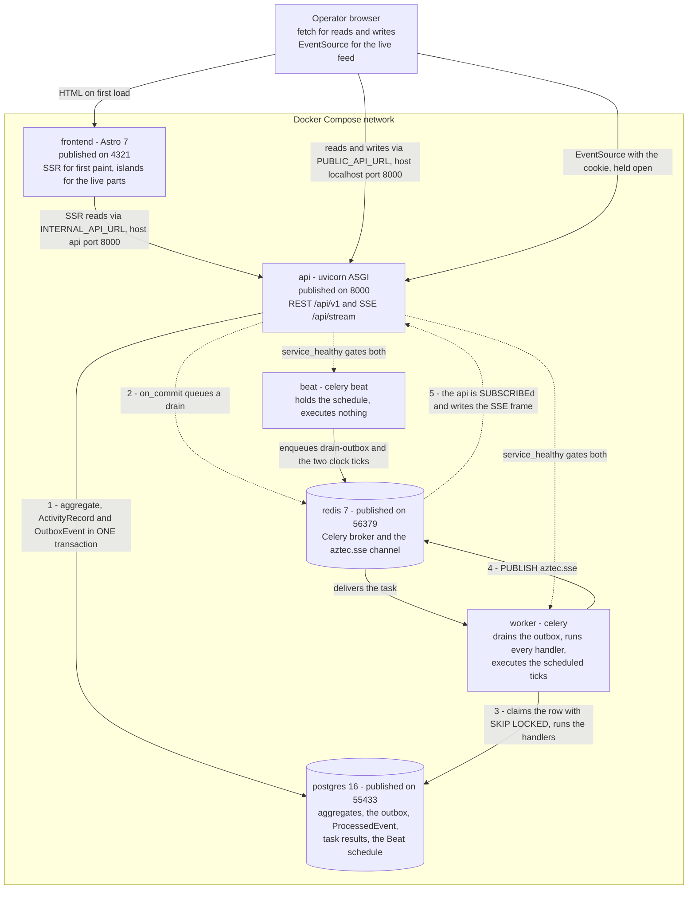
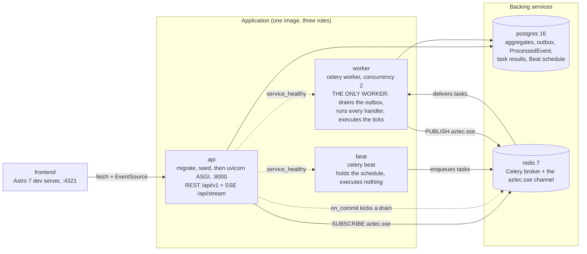
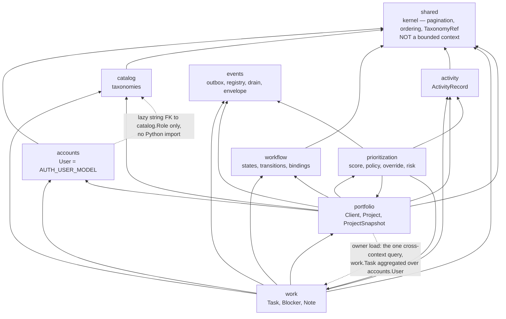
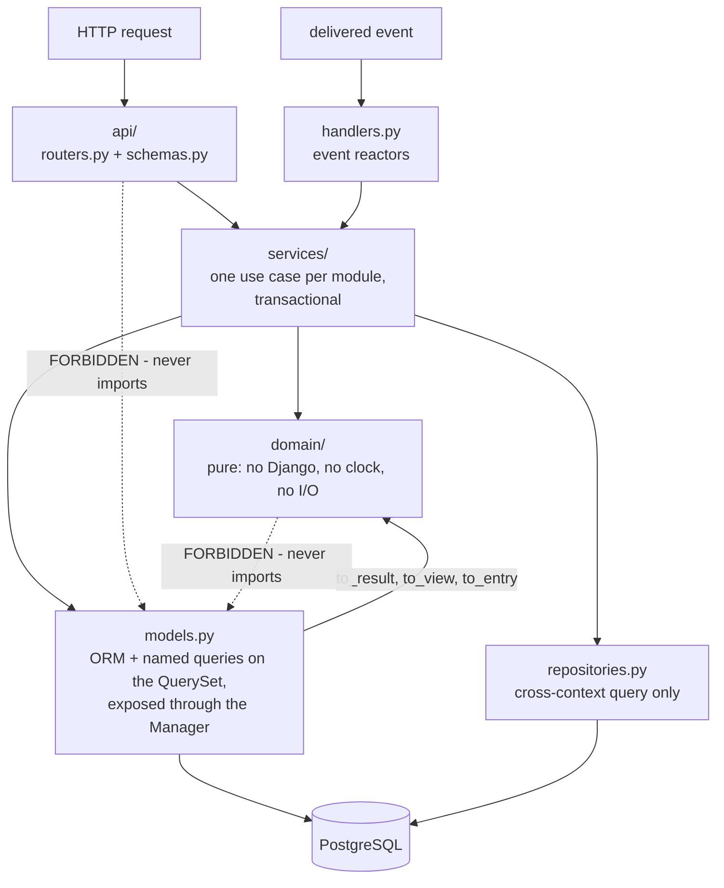
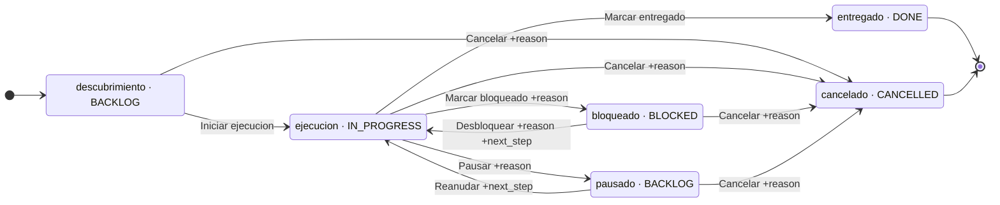
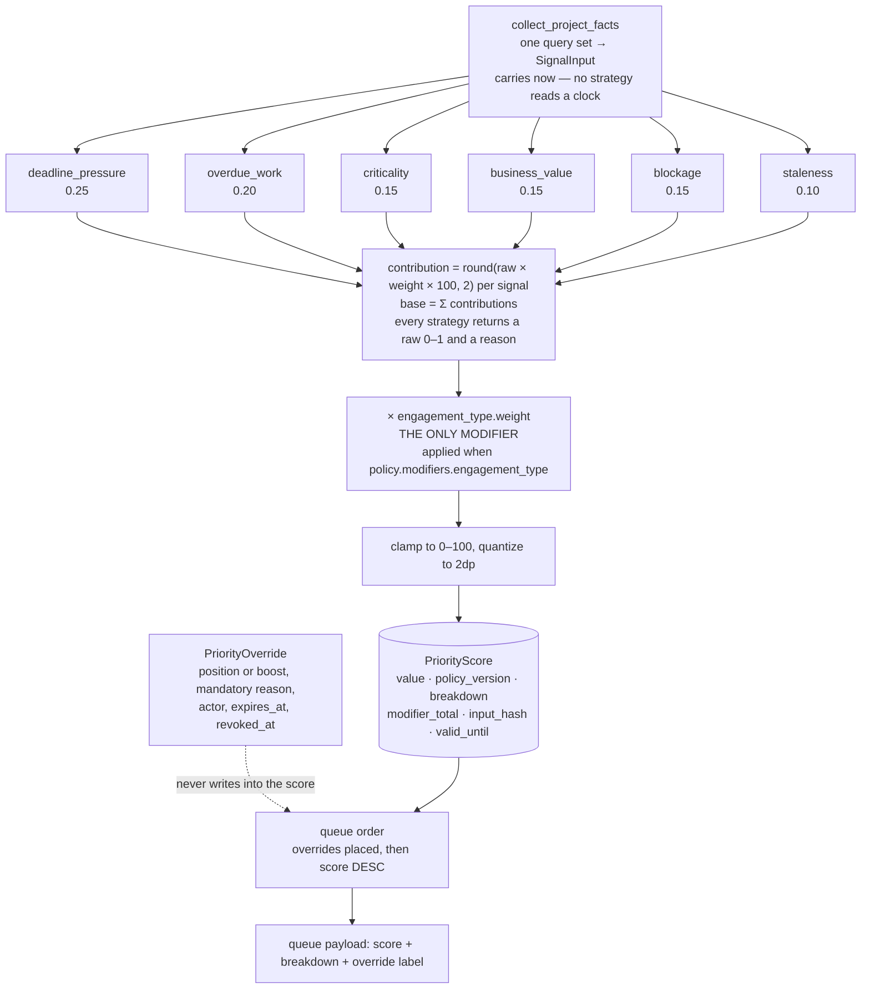
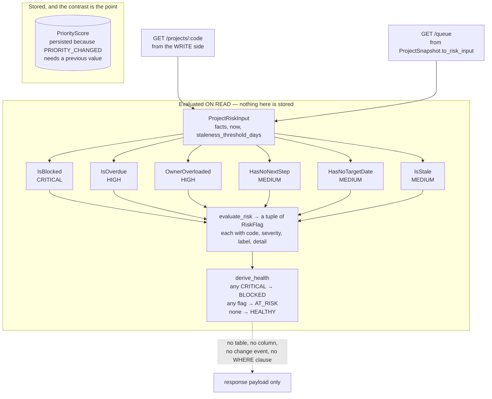
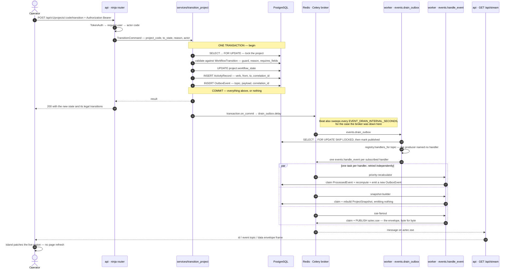
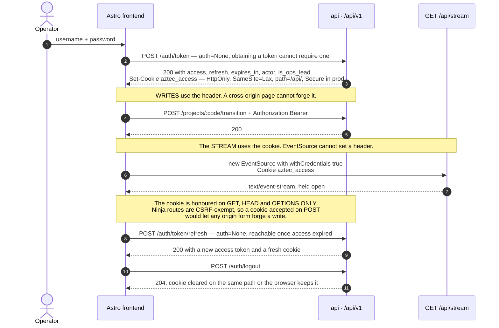

# Architecture — Aztec Ops

> Normative reference, and the map rather than the territory. Schemas live in
> [`DATA_MODEL.md`](DATA_MODEL.md), the HTTP contract in [`API.md`](API.md), the event catalog in
> [`EVENTS.md`](EVENTS.md), the product surface in [`../PRODUCT.md`](../PRODUCT.md) and the visual
> system in [`../DESIGN.md`](../DESIGN.md). This document says how the pieces fit and what each
> decision cost. It does not restate the others.
>
> If the code and this document disagree, one of them gets fixed — neither gets ignored.

---

## 1. What the system is for

A portfolio management system for an operation running many client engagements at once. It answers
three questions every morning:

1. What should be worked on today, and why exactly that?
2. What is at risk, blocked, or has no clear next step?
3. Who is overloaded?

It is **Jira-shaped in its mechanics and deliberately not Jira in its purpose**. Workflows are a
configurable graph of states and legal transitions, and the permission model is collaborative:
any signed-in member may act on any project or task, exactly as in Jira, because ownership scoping
would stop a colleague unblocking a project while its owner is on holiday (§9). What it adds on top
is the part Jira does not have — a deterministic, explainable ranking of the whole portfolio and a
risk read that treats *absence* (no next step, no target date, no activity) as data.

Minimum requirements from the challenge:

- create and update projects
- store owner, status, priority, due date, next step, blockers and notes
- detect projects at risk, blocked, or without a clear next step
- provide a useful view for operational follow-up
- expose an explicit, explainable prioritization criterion

---

## 2. Architecture decisions

Each row states what was chosen, why, and what was given up. Rows 3, 9, 10 and 11 record decisions
that **reversed an earlier one**; the ADR is where the reversal is argued.

| # | Decision | Why | Rejected alternative, and the cost accepted |
|---|---|---|---|
| 1 | Django 6 + django-ninja ([ADR 0001](adr/0001-django-and-django-ninja.md)) | The admin comes free for managing taxonomies, workflows and transitions without writing CRUD; Ninja gives a typed API whose schemas *are* Pydantic models, so a domain value object is returned and serialized without a translation layer | DRF — more ceremony, weaker typing. Cost: two routing systems in one process (ninja under `/api/v1`, Django's own for `/admin/` and `/api/stream`) |
| 2 | PostgreSQL ([ADR 0002](adr/0002-postgresql.md)) | Real transactions for the outbox; `SELECT … FOR UPDATE SKIP LOCKED` for the drain; JSONB for event payloads and score breakdowns | SQLite — no usable skip-locked claim, so the drain would need a lock table |
| 3 | Transactional outbox, **drained onto Celery** ([ADR 0003](adr/0003-transactional-outbox-with-redis-streams.md), superseded in part by [ADR 0010](adr/0010-celery-as-the-bus.md)) | The event is written in the same transaction as the state change. No dual write, no lost event. A drain task dispatches to a handler registry, so fan-out costs no process and no producer ever names a consumer | Publishing straight from the service — the event vanishes if the broker is down right after commit. **Redis Streams consumer groups** were the original transport and were removed: real consumer groups, but a second job system beside Celery's, with its own retry policy and its own dead-letter story. Cost: at-least-once delivery, so every handler must be idempotent |
| 4 | SSE, not WebSockets ([ADR 0004](adr/0004-sse-instead-of-websockets.md)) | The flow is one-way, server to client. SSE reconnects on its own, survives proxies, and resumes with `Last-Event-ID` | WebSockets — bidirectionality nothing here needs. Cost: the API must run on ASGI, and the browser cannot set a header on the stream request, which is what forces the access **cookie** (§9) |
| 5 | Deterministic, versioned prioritization ([ADR 0005](adr/0005-deterministic-versioned-prioritization.md)) | An operational ranking must be auditable and reproducible; every score persists its per-signal reason breakdown | LLM-driven ranking — neither auditable nor reproducible. Cost: the weights are a policy someone has to own, and changing them means a portfolio-wide rebuild |
| 6 | States, workflows and taxonomies in the database, not enums ([ADR 0006](adr/0006-workflows-and-taxonomies-as-data.md)) | The operation must evolve without a deploy; adding a state is a fixture row | `TextChoices` on the model. Cost: code may only compare against `code` and `category`, never against a label, and that rule has to be enforced at review |
| 7 | Django fixtures for seed data ([ADR 0007](adr/0007-django-fixtures-for-seed-data.md)) | Built in, versioned in git, deterministic; `loaddata` is one command and reviewers read the data as JSON | A custom xlsx importer in the runtime path. Cost: `loaddata` bypasses `Model.save()`, so business-code sequences need an explicit repair step (§11) |
| 8 | Astro with islands ([ADR 0008](adr/0008-astro-with-islands.md)) | Most of the product is server-renderable read views with a few genuinely live regions; server render gives the first paint and only those regions hydrate and listen to SSE | A full SPA — a router and a client store shipped for pages that are mostly static reads. Cost: shared client state (the one `EventSource`) lives in a store *outside* the component tree, and every live region is an explicit hydration boundary |
| 9 | Celery for the schedule **and** the bus ([ADR 0009](adr/0009-celery-beat-for-scheduling.md), [ADR 0010](adr/0010-celery-as-the-bus.md)) | One job system, not two. Beat's `crontab(hour=0, minute=0)` replaces a hand-rolled ticker loop that had to remember the last local date; the same worker drains the outbox, runs every handler and executes the ticks. **Seven application processes became three** | A hand-rolled ticker (in-process date state, wrong after every restart, duplicated by a second replica) and Redis Streams beside Celery. Cost: one worker is one failure domain — isolating a handler later means `--queues` and a routing rule, justified by a measurement |
| 10 | Risk flags computed on read, never stored — **and `PriorityScore` deliberately still stored** ([ADR 0011](adr/0011-risk-flags-computed-on-read.md)) | Every risk condition is a pure function of rows that already exist, over a clock; a stored derivation can be wrong, a computed one cannot — so the `RiskFlag` table, the risk-evaluator handler and the `project.risk.changed` topic all went. The score stays persisted for one reason that is not performance: `ActivityRecord.PRIORITY_CHANGED` needs a *previous value*, and a value computed on read has none | A `RiskFlag` table reconciled by a handler and re-checked on every tick — three copies of one conclusion, each able to disagree with the rows beneath it. Cost: `?health=` and `?risk_flag=` cannot be `WHERE` clauses (§8) |
| 11 | JWT access tokens, with the access token **also** an HttpOnly cookie honoured on safe methods only | An `X-Actor` header left permissions not merely unimplemented but *unrepresentable*, and made `ActivityRecord.actor` a claim rather than a fact. `EventSource` cannot set a header, so the stream authenticates by cookie; the cookie is refused on unsafe methods because ninja routes are CSRF-exempt (§9) | Session cookies with CSRF everywhere — the frontend is a separate origin. Cost: `CORS_ALLOW_CREDENTIALS = True`, so a wildcard origin is structurally banned; and there is no server-side revocation (§14) |
| 12 | `django-celery-results` + `django-celery-beat`: results and the schedule in PostgreSQL, both in the admin | "When does this run" and "did it run, and what did it say" are answerable without reading a container log. This is why every task returns a **readable sentence** rather than a bare count | Redis results — ephemeral and invisible. Cost: a `TaskResult` table that grows (bounded by `CELERY_RESULT_EXPIRES`, one week), and one trap: an entry defined in `CELERY_BEAT_SCHEDULE` is *owned by settings* and an admin edit to it is overwritten on the next Beat start (§7.5) |

---

## 3. The shape of the system

### 3.1 Containers, and the path a push takes

Everything runs on one Compose network. Two things published to the host are what a person
actually touches — the Astro dev server on 4321 and the API on 8000 — and PostgreSQL and Redis are
published too (55433, 56379), deliberately off their default ports so they cannot collide with
whatever the developer already runs.

The numbered edges are one live update travelling from a write to a pixel. That path is the whole
product: everything else here exists to make step 4 arrive.



Two details in that picture are load-bearing and easy to miss.

**The frontend calls the API by two different names.** Server-side rendering happens inside the
network and reaches `http://api:8000`; the browser reaches the same service through the published
port at `http://localhost:8000`. One URL cannot serve both callers, which is why
`INTERNAL_API_URL` and `PUBLIC_API_URL` both exist.

**The push never leaves PostgreSQL's guarantee to reach Redis.** Step 1 commits the event with the
change, so a crash anywhere in steps 2 to 5 loses nothing — Beat's sweep finds the unpublished row
and the path resumes. Redis carries the delivery, never the truth.

### 3.2 Process roles

**Three long-running application processes** and two backing services. There is one worker, and it
is simultaneously the outbox drain, every event handler and the executor of the scheduled ticks.



- **`api`** runs `migrate`, then `seed` (skipped when `ENVIRONMENT=production`), then serves ASGI —
  not negotiable: `GET /api/stream` holds a connection open per dashboard, and a WSGI worker would
  hold a thread for each one. `worker` and `beat` gate on `condition: service_healthy`, and the
  probe is `GET /api/v1/health/live`, so by the time either starts the schema exists and nothing
  crash-loops against a missing table. It is the only migrator: an `api` scaled to two replicas
  would have both migrating the same database at once, and that is the point at which migrations
  move back into a deploy job.
- The start-up sequence for all three roles lives in `backend/docker-entrypoint.sh`; Compose only
  names the role (`command: ["worker"]`). Flags, `--reload` and the migrate/seed step are properties
  of the image, so a deploy that is not Compose inherits them instead of restating them.
- **`worker`** is the bus. `--concurrency 2` because the work is database-bound and each process
  holds its own PostgreSQL connection.
- **`beat`** depends on Redis alone, because it keeps no domain state.

**Do not re-split the worker.** This stack used to run five application processes — a relay plus
three Redis Streams consumer groups plus a Celery worker — for 22 projects and 82 tasks, with two
job systems doing one job. One queue per handler is a throughput answer to a problem this workload
does not have. If a handler ever needs isolating, the honest version is `--queues` plus a routing
rule for that handler alone, and a measurement in the commit message.

### 3.3 Bounded contexts

Eight Django apps, plus one shared kernel that is **not** a context. An arrow means *may import*.



What the graph is asserting:

- **`events` imports nothing.** It is the transport. It knows a topic, an envelope and a handler
  name, and nothing about scoring, projects or people. That is what lets a handler be added without
  the bus learning anything.
- **`accounts` is depended on and depends on nothing in Python.** Its only outward reference is the
  nullable `role` foreign key, declared as the string `"catalog.Role"` — a schema edge, not an
  import edge. `INSTALLED_APPS` loads it first, because `AUTH_USER_MODEL` is referenced by
  everything that follows.
- **`shared` is a kernel, not a context.** `Page[T]`, ordering resolution and `TaxonomyRef` are
  shapes the API speaks in, owned by no business area. Contexts import it directly and that is
  allowed precisely because it holds no business rule and no model.
- **The one deliberate exception**, dotted: owner load. Its numerator aggregates `work.Task`; its
  denominator is a column of `accounts.User`. No single model's manager can carry it without
  learning about the other context, so it lives in `backend/apps/portfolio/repositories.py` — the
  context that *consumes* the answer. That module's own docstring says not to tidy it onto a
  manager. It is the only `repositories.py` in the codebase (§3.3).
- **`portfolio` and `prioritization` reference each other**, and that is read-side composition, not
  a layering mistake: `prioritization` reads `Project` to assemble signal inputs, and
  `portfolio.services.read_project_detail` calls `read_project_priority` to attach the score and
  the flags to a project detail. Neither writes into the other's tables.

### 3.4 Layers inside a context

```
backend/apps/<context>/
  domain/          # pure. No django.db import. Provable on SimpleTestCase.
  models.py        # persistence + named queries as QuerySet/Manager methods + to_*() projections
  repositories.py  # rare, one instance in the whole codebase (owner load)
  services/        # one use case per module. Transactional.
  api/             # routers.py + schemas.py. HTTP <-> services. Zero logic.
  handlers.py      # event reactors. The module NAME is fixed.
  admin.py         # operator surface
  fixtures/        # seed data, stable primary keys
  tests/           # TestCase classes (§13)
  management/commands/   # exists in `portfolio` only, and holds exactly `seed`
```

`domain/` is not a fixed file list. Depending on the context it holds `errors.py`,
`value_objects.py`, `views.py`, `specifications.py`, `policies.py`, `scoring.py`, `registry.py`,
`types.py`, `signals/`, `guards/`, `rules.py`, `commands.py`, `dependencies.py`, `envelope.py`,
`routing.py`, `changes.py`. Two of those are conventions worth naming:

- **`domain/views.py`** — the read-side value objects a service returns and ninja serializes
  directly. They are Pydantic models, so there is no second schema restating the same fields.
- **`domain/registry.py`** — the open/closed seam. A priority signal or a risk criterion is one
  class plus one decorator line; the evaluator never learns the class's name (§5, §6).



The two crossed links are the illegal arrows, and they are the whole rule:

- **`api/` never imports `models`.** A router that filtered a queryset would put a business rule in
  the HTTP layer, where no test that does not speak HTTP can reach it.
- **`domain/` never imports Django.** Enforced by the test base class rather than by discipline:
  domain suites run on `SimpleTestCase`, which *forbids* database access, so an accidental import
  that touches the ORM fails the suite (§13).

Two more rules that have no arrow to cross out:

- **`services/` never imports `api/`**, and never imports the Redis client. A service that
  published directly would be the dual write the outbox exists to prevent; it writes an
  `OutboxEvent` and nothing else (§7).
- **Named queries live on the model's `QuerySet`, exposed through its `Manager`**, built with
  `QuerySet.as_manager()` or `Manager.from_queryset(...)`:

  ```python
  Task.objects.assigned_to(user).open().overdue(as_of=today)   # one lazy query, filters ANDed
  ```

  A module-level `open_tasks_for(user) -> list[Task]` cannot be narrowed further, so every new
  combination needs a new function. A method that must materialise (a count, an aggregate, a dict)
  is fine, and its docstring says so, because it ends the chain.

- **A model knows how to describe itself.** `Project.to_result()`, `ActivityRecord.to_entry()`,
  `ProjectSnapshot.to_queue_item()`, `PriorityScore.to_view()` are methods, never free functions
  reading twelve attributes off an object they were handed. This is a projection of self, not a
  business rule, so it does not violate "models.py holds persistence only".

### 3.5 What is stored and what is computed

Stated once, here, because it is a deliberate asymmetry that a reader will otherwise diagnose as an
inconsistency.

| Derived value | Stored? | Why |
|---|---|---|
| **Risk flags** (`BLOCKED`, `OVERDUE`, `NO_NEXT_STEP`, `NO_TARGET_DATE`, `STALE`, `OWNER_OVERLOADED`) | **No.** No table, no column, no change event, no `WHERE` clause | Each is a pure function of rows that already exist, over a clock. A stored copy can disagree with the rows beneath it; a computed one cannot ([ADR 0011](adr/0011-risk-flags-computed-on-read.md)) |
| **Health** (`HEALTHY` / `AT_RISK` / `BLOCKED`) | **No** | Derived from the flag set by `derive_health`, in one place (§6) |
| **Priority score** | **Yes**, in `PriorityScore` | Not for speed. `ActivityRecord` records `PRIORITY_CHANGED` with a before and an after, and a value computed on read has no before — so no event, and no live reprioritization |
| **Owner load** | **No** | Aggregated from `work.Task` at read time. The source dataset's `Team` sheet ships its own counters and they are deliberately not imported: a stored count and the tasks it summarises drift apart silently |
| **The read model** (`ProjectSnapshot`) | **Yes**, rebuilt per event | It denormalizes *facts* that are expensive to aggregate — never conclusions (§8) |

The consequence of the first row, taken deliberately: a value computed on read has no previous set
to compare against, so it has **no change event**. Nothing pushes "this project just became at
risk". The flags ride along in every project payload and are correct the moment anyone asks.

---

## 4. Domain model

Schemas, columns, constraints and indexes are [`DATA_MODEL.md`](DATA_MODEL.md). This section is
what each context is *for* and the invariants that do not fit in a column comment.

### 4.1 Identity (`accounts`)

`accounts.User` extends `AbstractUser` and **is the person**. It exists on day one because
`AUTH_USER_MODEL` cannot be changed after the first migration without hand-written surgery across
every table holding a user foreign key — the cost now is zero, the cost later is a weekend.

Beyond what `AbstractUser` supplies:

- `code` — stable slug, unique, the identifier the event bus, the fixtures and every payload use
  (`camila.torres`). `username` mirrors it.
- `alias` — display name from the source data (`Camila Torres`).
- `role` — nullable FK to `catalog.Role`, `on_delete=SET_NULL`.
- `weekly_capacity_points` — the *denominator* of owner load.
- `is_ops_lead` — a **property over `is_staff`**, and the entire authorization model of the
  product (§9). It is a property rather than a column so there is one flag to set, in the admin
  that already has a checkbox for it.

There is no separate `TeamMember`. Whoever is assigned a task is whoever signs in to move it, so
they are one entity. The earlier design gave `TeamMember` a nullable one-to-one to the account: a
nullable link that is never null lies in the schema and forces a `request.user.team_member` hop
that can be `None` at every permission check. The cost is written down rather than hidden —
identity now carries two operational attributes (`role`, `weekly_capacity_points`), and the
alternative, a profile table joined on every read, buys purity paid for on every query.

Two things did **not** move into `accounts`:

- **Owner load.** `weekly_capacity_points` describes the person; the numerator is an aggregation
  over `work.Task`. That query stays in `portfolio/repositories.py` (§3.3).
- **`ActivityRecord.actor`.** It stays a string rather than a foreign key, precisely so the engine
  and the handlers can write records as `system` without a fake user row existing to satisfy a
  constraint. `Note.author` is a string for the same reason, plus one more: a note must survive its
  author leaving the roster.

**Seeded people can sign in.** The five people in the source dataset are real assignees. `seed`
applies `SEED_USER_PASSWORD` to every non-superuser account when that variable is set, and falls
back to `set_unusable_password()` when it is not (§11). The fallback is the safe default for a
public repository, not the demo path.

### 4.2 Configurable taxonomies (`catalog`)

Anything the operation might want to change without a deploy lives in admin-editable tables. Every
taxonomy carries `code` (stable slug — **the only thing code compares against**), `label`, `order`,
`is_active` and `color`, plus whatever the engine consumes:

- `EngagementType` — Proyecto / Mantenimiento o recurrente / Diagnostico. Carries `weight`, the one
  policy modifier (§5).
- `ProjectType` — Automatizacion / Consultoria (the dataset's `project_type_api`).
- `Stage` — Descubrimiento, Ejecucion. Ordered.
- `Priority` — Critica / Alta / Media / Baja, with numeric `weight` **and `is_urgent`**. `weight` carries
  relative severity; `is_urgent` is the structural fact marking which codes count as urgent, and it
  is what the `criticality` signal and `urgent_open_task_count` read. Keeping that as data rather
  than a literal set of codes is what lets the operation add a priority level without a deploy.
- `Role` — a person's role on the team.
- `Currency` — the ISO-4217 code a project is billed in, with `minor_units`. A taxonomy and not a
  `varchar(3)` because the frontend renders a validated select from the served list, and
  `minor_units` is the one fact it cannot derive: 28000 CLP is not 28000 USD.

The whole vocabulary is served in one document by `GET /api/v1/catalog`, so the client hardcodes no
list of anything. **Code never compares against labels.**

### 4.3 Configurable workflows (`workflow`)

A workflow is a directed graph of states.

- `Workflow` — `code`, `name`, `applies_to` (`PROJECT` | `TASK`), `is_default`, `is_active`.
- `WorkflowState` — `code`, `label`, `category` (`BACKLOG | IN_PROGRESS | BLOCKED | DONE |
  CANCELLED`), `is_initial`, `is_terminal`, `order`, `color`.
- `WorkflowTransition` — `from_state`, `to_state`, `label`, `requires_reason`, `requires_fields`
  (fields that must be non-empty to transition, e.g. `next_step`), `guard` (the code of a
  registered guard), `is_active`, `order`.
- `WorkflowBinding` — binds a workflow to an `EngagementType`, or marks the default. A Diagnostic
  can follow a different lifecycle from a recurring maintenance engagement.

**`category` is what the rest of the system reads — never `code`.** "Is it blocked?" and "is it
closed?" are questions about the category. That is what lets a new state be added as a fixture row
with zero code changes, on either side.

The seeded `project_default` workflow, which is what the demo exercises:



`+reason` is `requires_reason`; `+next_step` is an entry in `requires_fields`. Note what the
categories buy: `pausado` and `descubrimiento` are both `BACKLOG`, so every rule about "not started"
covers both without naming either, and `IsBlocked` fires on `bloqueado` because of its category —
a second blocked state would be covered for free. The task workflow (`task_default`) is a separate
graph with two `IN_PROGRESS` states, `en_progreso` and `en_revision`, for the same reason.

Hard rules:

- A transition can **only** run if an active `WorkflowTransition` `from → to` exists. No API route
  assigns `workflow_state` directly.
- The transition service validates guards, demands `reason` when the transition requires it,
  checks `requires_fields`, and records the change.
- An illegal transition raises the domain error `TransitionNotAllowed`, mapped to a 409 by the one
  central handler in `config/errors.py` — never a 500, never a scattered `HttpResponse`.
- The legal transitions of a project are part of its API payload. The frontend holds no list of
  state codes and never guesses legality, which is what makes adding a state zero frontend work.

### 4.4 Portfolio and work (`portfolio`, `work`)

- `Client` — `code`, `alias`, `notes`, `is_active`.
- `Project` — `code`, `name`, `client`, `engagement_type`, `project_type`, `stage`,
  `workflow_state`, `owner`, `start_date`, `target_date`, `business_value`, `currency`, `summary`,
  `next_step`, `is_archived`, `imported_health`.
  `imported_health` is the source spreadsheet's own `Sano | En riesgo | Bloqueado` value, kept as a
  **cross-check** against what the specifications derive. The derived value is the one the system
  uses; nothing reads `imported_health` to make a decision.
- `Task` — `code`, `project`, `assignee`, `priority`, `workflow_state`, `due_date`, `title`,
  `detail`, `last_progress`.
- `TaskDependency` — `task` → `depends_on`, plus `raw_label` for dataset values that arrive as free
  text and resolve to no existing task, and `is_resolved` for whether that text was matched. Cycles
  are rejected.
- `Blocker` — `code`, attached to a project or a task, with `description`, `kind`
  (`EXTERNAL_DEPENDENCY | ACCESS | DECISION | TECHNICAL`), `raised_at`, `resolved_at`, `owner`,
  `resolution_reason`. An open blocker is a first-class fact, not a string in a notes field.
- `Note` — `code`, `body`, `author`, chronological comments on a project or task.

**There is no person model here.** `Project.owner`, `Task.assignee` and `Blocker.owner` are foreign
keys to `AUTH_USER_MODEL`. What stays in `portfolio` is the *question* about a person that only
this context can answer — `owner_load_for_codes` (§3.3).

Domain invariants:

- A project with no `next_step` and no task in an `IN_PROGRESS` state has **no clear next step**.
- A project is **blocked** if it has at least one open `Blocker`, **or** its state category is
  `BLOCKED`, **or** at least one of its tasks is in a `BLOCKED` state.
- A null `target_date` is not harmless missing data — it is a risk signal (`NO_TARGET_DATE`).

### 4.5 Audit trail and timeline (`activity`)

`ActivityRecord` is append-only: never updated, never deleted.

`entity_type`, `entity_id`, `verb`, `origin`, `actor`, `from_value`, `to_value`, `reason`,
`metadata` (JSONB), `occurred_at`, `correlation_id`.

Verbs: `CREATED`, `STATE_CHANGED`, `PRIORITY_CHANGED`, `BLOCKER_RAISED`, `BLOCKER_RESOLVED`,
`OWNER_CHANGED`, `NEXT_STEP_SET`, `TASK_ADDED`, `NOTE_ADDED`, `SEEDED`.

Origins, which is how a reprioritization is read:

- `SYSTEM` — the default, for a record no human and no policy specifically authored.
- `POLICY` — the engine recomputed because data or time changed; the record names the signal that
  moved.
- `MANUAL` — a human forced the position. Reason is mandatory.

`correlation_id` chains "deprioritize A in order to prioritize B" into a single movement, so the UI
can show it as one decision instead of two unrelated facts. Every event carries the same
`correlation_id`, so a decision can be reconstructed across the audit trail and the bus together.

The project timeline is `ActivityRecord` filtered by entity, served by
`GET /api/v1/projects/{code}/activity`. A **portfolio-wide** feed is specified in
[`PRODUCT.md`](../PRODUCT.md) and is not built: it needs a global activity endpoint that does not
exist yet (§10).

---

## 5. Prioritization engine (`prioritization`)

### 5.1 The criterion

A 0–100 score: the weighted sum of six normalized signals. Each signal is an independent
**strategy** class returning `(score_0_1, reason)`, registered under a stable code. The policy lives
in the database and is versioned — `PriorityPolicy(version, is_active, weights, modifiers)` — and
the active seed policy is `v1`.

| Signal | Weight | What it measures |
|---|---|---|
| `deadline_pressure` | 0.25 | Days until `target_date`, against a sixty-day horizon. Overdue = 1.0 and stays there. No date = 0.5 — not safe, not urgent — and the missing date is surfaced as a flag instead of being smuggled into the number. |
| `overdue_work` | 0.20 | Ratio of overdue tasks to open tasks. |
| `criticality` | 0.15 | Count of open tasks whose priority is marked `is_urgent`, saturating at five. Never a hardcoded list of priority codes. |
| `business_value` | 0.15 | Contract value, normalized on a log scale against the portfolio maximum — 28k does not deserve 3.5× the operational attention of 8k. |
| `blockage` | 0.15 | Open blockers and how old they are. An old blocker *raises* the score: it needs intervention, not patience. |
| `staleness` | 0.10 | Days without recorded activity, plus absence of `next_step`. |



Read the diagram for what it refuses to do. **There is exactly one modifier**, `engagement_type`,
and it multiplies the weighted sum rather than adding to it — a Diagnostic near its deadline does
not compete on the same footing as recurring maintenance. Owner saturation is **not** a modifier:
an overloaded owner raises the `OWNER_OVERLOADED` risk flag (§6) and does not lower the score.
Priority belongs to the work, not to who happens to be free.

Every `PriorityScore` persists `value`, `policy_version`, `breakdown` (JSONB: each signal, its raw
value, its weight, its contribution and its human-readable reason), `modifier_total`, `computed_at`,
`input_hash` and `valid_until`. The UI shows the "why" next to the number. That is what makes the
ranking defensible, and `input_hash` is what lets a recomputation report `changed=False` instead of
writing an identical row.

**Adding a signal is one class plus one `@register("code")` line, and a weight in the policy.** If
you have to edit an existing `if`, the design is wrong.

### 5.2 When scores are recomputed

Two triggers, because there are two ways a score goes stale.

**Data changed.** Any project mutation writes an `OutboxEvent`; the `priority-recalculator` handler
picks it up, recomputes that one project and emits `project.priority.recalculated`, which reaches
the browser through `sse-fanout`. This needs nothing beyond the event path (§7). The handler
subscribes to every write-side topic plus `clock.ticked`, and deliberately **not** to what it emits
— a handler that consumed its own output would recompute forever. The graph is acyclic by
construction, not by a guard somewhere downstream.

**Time passed.** `deadline_pressure` and `staleness` are functions of *now*, not of any event. A
project can cross its target date or go stale without a single mutation, and nothing in an
event-driven system notices that on its own. So the clock is an explicit participant: Beat emits
`clock.ticked` (§7.5), and the tick is a producer like any other — it writes an outbox row and goes
through the drain exactly like a transition does.

Recomputing all 22 projects on every tick would work at this size and would be the wrong shape at
any other. Instead each score persists **`valid_until`**: the earliest future instant at which any
time-dependent signal would change bucket — the target date itself, the start of the final week, or
the staleness threshold, whichever comes first. The handler selects only the projects whose
`valid_until` has passed. On a quiet tick that query returns nothing and the tick costs one index
scan.

**The cost accepted:** a score can be at most one tick out of date with respect to *time*. For a
board read once a morning, five minutes of clock drift is not a decision-changing error. Data
changes — the ones a human just made and is watching for — propagate immediately.

The manual rebuild path exists for two bootstrap cases only: right after seeding, and after
activating a new policy version, when every score must be rebuilt against new weights. It is
deliberately **not** a management command — a command run from a laptop against production has no
audit trail, no permission check and no undo. It is the "Recompute priority for selected projects"
admin action, `POST /api/v1/projects/{code}/recompute` (any member), and
`POST /api/v1/recompute` (**ops lead only**, §9).

### 5.3 Manual override

`PriorityOverride(project, position | boost, reason, actor, expires_at, revoked_at)`. Reason is
mandatory; specifying both `position` and `boost` is a domain error.

**The override is stored beside the computed score and never inside it.** Writing it into
`PriorityScore.value` would make a forced number indistinguishable from a computed one, destroy the
UI's ability to label the row, and require a recomputation to undo something that should be
reversible by revoking a row. Applying one emits an `ActivityRecord` with verb `PRIORITY_CHANGED`
and origin `MANUAL`.

Two routes, both **ops lead only**: `POST` and `DELETE` on
`/api/v1/projects/{code}/priority-override`. Revocation sets `revoked_at` rather than deleting the
row, so the decision and its reversal both stay in the record.

---

## 6. Risk detection (Specification pattern)

Six composable specifications, each a pure class deciding one thing from facts it is handed,
supporting `and` / `or` / `not`. Each declares its own severity at its registry line, and health is
derived from the resulting set.



- `IsBlocked` — an open blocker, or state category `BLOCKED`, or a task in a `BLOCKED` state.
- `IsOverdue` — `target_date` in the past, or overdue tasks.
- `HasNoNextStep` — no `next_step` and no task in progress.
- `HasNoTargetDate` — an active project with no committed date.
- `IsStale` — no activity for `STALENESS_THRESHOLD_DAYS` (default 14, configurable).
- `OwnerOverloaded` — owner load above `weekly_capacity_points`.

The severities are **code-owned and reviewed**, declared on the `@register_risk(...)` line, because
they are the ordering the operator's attention follows and they are exactly the kind of thing that
must not change silently from an admin form. They are what `derive_health` reads.

Each specification also carries its own `label` — the Spanish chip text — beside the `detail` it
writes, and both travel on the wire with the flag. The frontend may not hold a map from flag code to
copy (`docs/standards/FRONTEND.md` §7), so a criterion that could not name itself would reach the
operator as a bare `NO_TARGET_DATE`; putting the words on the class is what keeps a seventh criterion
a backend-only change. Spanish there is the interface language (`PRODUCT.md`), the same exception the
database's user-facing labels have — identifiers, class names and docstrings stay English.

The same evaluator serves both read paths, from two different sources of facts — the write
aggregates for a project detail, `ProjectSnapshot.to_risk_input()` for the queue — and that is why
there is one implementation and no SQL predicate anywhere restating a specification.

**Adding a risk criterion is one class — with its `label`, its `is_satisfied_by` and its `detail` —
plus one `@register_risk(flag_code=..., severity=...)` line.** Nothing else changes.

---

## 7. The event path

### 7.1 The write path, end to end

This is the most important picture in the document. The transaction boundary is where the design
lives: the aggregate, the audit record and the outbox row commit together or not at all.



Points the diagram is making that a paragraph would bury:

- The HTTP response returns **before** any handler runs. A slow reactor cannot slow a write.
- `transaction.on_commit` is not a dual write: registering the callback schedules nothing until the
  transaction commits, so a rolled-back write queues no task, and a committed one cannot have
  failed to write the row.
- The drain marks the row published *inside* the claiming transaction and queues the handler tasks
  from that transaction's `on_commit`, so a rolled-back drain queues nothing.
- **`CELERY_TASK_ACKS_LATE = True` is load-bearing here.** The row is published before the handler
  runs, so a worker killed mid-delivery with early acknowledgement would drop an event the outbox
  already considers dispatched. With late acks the broker redelivers and `ProcessedEvent` absorbs
  the duplicate. The cost is that a hard-killed task runs twice — which every handler tolerates by
  design.
- `drain_outbox` **re-queues itself on a full batch**, so a burst drains at broker speed instead of
  being held in one long transaction.

### 7.2 The handler registry — the extension point

A handler is a function in `apps/<context>/handlers.py` decorated with
`@register_handler(name=..., topics={...})`. **The module name is fixed**: app-ready autodiscovers
exactly `handlers`, and a reactor declared anywhere else is never imported and silently never runs.
The registry is pure Python — no model, no Celery, no Redis — so a registration is assertable on
`SimpleTestCase`, and an unknown topic or a duplicated name raises at *import* time rather than
when the event finally fires.

There are exactly three handlers.

| Handler | Subscribes to | Effect | Emits |
|---|---|---|---|
| `priority-recalculator` (`prioritization`) | every write-side topic **plus** `clock.ticked`; **not** `project.priority.recalculated` | Recompute one project's score, or, for a tick, every project whose `valid_until` has passed | `project.priority.recalculated` |
| `snapshot-builder` (`portfolio`) | `ALL_TOPICS - {clock.ticked}` — by subtraction, so a new topic is subscribed the moment it is registered | Wholesale rebuild of that project's `ProjectSnapshot` row | nothing — which is what makes it safe to subscribe to everything, including derived topics |
| `sse-fanout` (`events`) | `SSE_ALLOWLIST_TOPICS` = `ALL_TOPICS - {clock.ticked}` | `PUBLISH` the envelope onto `aztec.sse`, unchanged | nothing |

`clock.ticked` is excluded from the browser deliberately: it renders nothing, a browser has its own
clock, and forwarding it would push a frame to every open tab every `TICKER_INTERVAL_SECONDS` for
the client to discard. What the tick *causes* — `project.priority.recalculated` — is on the
allowlist and arrives normally.

**What a handler may assume:**

- It runs inside an open `transaction.atomic()` that already contains the `ProcessedEvent` claim for
  `(envelope.id, name)`. Everything it writes commits with that claim or not at all.
- It is never called twice for the same `(event_id, handler)` *after a success*. It can absolutely
  be called twice after a failure. Deduplication is per handler.
- `envelope.topic` is always in its declared `topics`, so widening a subscription later replays
  nothing.
- **Time comes from the envelope** — `occurred_at`, or `payload.tick_at` for a tick — never from the
  wall clock. A redelivery must land on the same result.

**What a handler must not do:** catch its own failures to keep things moving (raising is how the
retry, the log line and the dead letter happen), or open a second connection / commit the enclosing
transaction, which breaks deduplication.

`sse-fanout` is the one handler permitted to hold a Redis client: publishing *is* its effect, so
there is no database write for it to be inconsistent with.

### 7.3 Envelope, topics and the routing contract

The stable envelope — full schemas in [`EVENTS.md`](EVENTS.md) §1 and §4:

```json
{
  "id": "uuid",
  "topic": "project.state_changed",
  "occurred_at": "2026-07-28T10:00:00Z",
  "actor": "camila.torres",
  "correlation_id": "uuid",
  "entity": {"type": "project", "id": "PRJ-01"},
  "payload": {"from": "ejecucion", "to": "bloqueado", "reason": "..."},
  "version": 1
}
```

`actor` is an `accounts.User.code`, or the literal `system` when the engine or the clock caused the
change.

Eleven topics, and a topic absent from `ALL_TOPICS` does not exist: `project.created`,
`project.updated`, `project.state_changed`, `project.priority.recalculated`, `task.created`,
`task.updated`, `task.state_changed`, `blocker.raised`, `blocker.resolved`, `note.added`,
`clock.ticked`. Topic names are immutable once released — they are matched by handler subscriptions
and by the frontend's `EventSource` listeners, so renaming one means emitting both for a release.

**The routing contract, which producers must follow.** `apps/events/domain/routing.py` answers the
two questions every project-scoped handler asks: `project_code_of(envelope)` and
`tick_at_of(envelope)`. The rule it encodes is that a project event carries the project in
`entity.id`, and **every non-project topic carries `payload.project_code`** — which is precisely
what lets a task, blocker or note event aggregate to a project without a foreign key into the
emitting context. A producer that omits it raises `EventNamesNoProjectError`, which dead-letters the
row where it stays visible rather than being silently dropped.

### 7.4 Failure, retry and the dead letter

- **Idempotency** is `ProcessedEvent(event_id, handler)`. At-least-once means the same event will
  arrive twice; the handler must survive that.
- **A failing handler does not block the others** — one delivery task per handler per event, so
  they retry and fail independently.
- **Backoff** is roughly 1s, 2s, 4s, 8s, 16s, with 25% jitter so two handlers that failed on the
  same downstream outage do not retry in lockstep.
- Past `EVENT_MAX_ATTEMPTS` (default 5, counted per handler) the **outbox row itself** is
  dead-lettered: `dead_lettered_at` and `last_error` are set on the row that already exists, the
  failure is logged at ERROR with the event id, topic and handler, and the exception is re-raised so
  the Celery result is a failure too. Nothing is swallowed and nothing is deleted — the event stays
  at `/admin/events/outboxevent/`, where the re-queue action can replay it. An event dying silently
  is worse than a loud error.
- Every task **returns a readable sentence**, not a count, because `django-celery-results` renders
  the return value in the admin: *"Dispatched 12 event(s); 41 still pending."* answers the
  operator's actual question.

### 7.5 The schedule

Three Beat entries, all defined in `CELERY_BEAT_SCHEDULE` and synced by `DatabaseScheduler` into
`django_celery_beat` `PeriodicTask` rows **on every Beat start**.

| Entry | Task | Schedule | What it is for |
|---|---|---|---|
| `drain-outbox` | `events.drain_outbox` | every `EVENT_DRAIN_INTERVAL_SECONDS` (5s) | The **safety net, not the hot path**. `on_commit` already kicks a drain; this catches the one case that kick cannot — the broker was down at commit time. Both paths read the same table, so a double dispatch is absorbed by the ledger |
| `emit-interval-tick` | `events.emit_interval_tick` | every `TICKER_INTERVAL_SECONDS` (300s) | Makes time an event. This interval **is** the upper bound on how stale a time-derived score can be (§5.2) |
| `emit-day-boundary-tick` | `events.emit_day_boundary_tick` | `crontab(hour=0, minute=0)` | Calendar facts — overdue, days open — change at the date boundary, not on a five-minute grid. Separate on purpose: the alternative is remembering the last local date in-process, which is wrong after every restart |

Beat also installs `celery.backend_cleanup` by itself, which is what enforces
`CELERY_RESULT_EXPIRES` (one week).

**The trap, worth knowing before someone loses an edit:** an entry defined in settings is *owned by
settings*. Editing its interval in the admin works until Beat next restarts, and then the sync
overwrites it. An entry an operator should own must be created in the admin only and must never
appear in `CELERY_BEAT_SCHEDULE`. The `description` text of each entry is written in settings for
the same reason — it is not a Celery key, `DatabaseScheduler` passes it through to the model, and
writing it there is what keeps it from being overwritten.

---

## 8. The read path (CQRS-lite)

The command center needs a heavy join: project + score + owner load + task and blocker counts,
ranked. Resolving that through the ORM on every request does not hold up.

`ProjectSnapshot` is a denormalized read model, rebuilt wholesale by `snapshot-builder` whenever any
event for that project arrives — never patched column by column, because a partial rebuild leaves
one row holding columns from two deliveries while `last_event_id` claims a single one.

**Two read paths, and the split is deliberate:**

| Read | Source | Why |
|---|---|---|
| `GET /api/v1/queue` | `ProjectSnapshot` | A list of 22 rows must not pay for a six-table join with per-row aggregates. One index scan: `portfolio_snap_queue` on `(is_archived, -priority_score)` matches the sort, so the plan carries no sort node |
| `GET /api/v1/projects/{code}` | **the write side** | A single project must not be rendered from a projection a consumer has not rebuilt yet. An operator who has just moved a project and lands on its detail page has to see the move |
| `GET /api/v1/projects/{code}/tasks` | the write side | Two queries whatever the filters: one `COUNT(*)`, one windowed scan |
| `GET /api/v1/team/load` | the write side | Aggregated from `work.Task` at read time, never denormalized onto the person (§3.5) |

**The snapshot denormalizes facts, never conclusions.** There is no `risk_flags` column and no
`health` column: both are derived from the row's own counts and dates on every read, so a row nobody
has rebuilt since yesterday still reports today's truth.

What it stores is what is expensive to aggregate, plus two things that matter architecturally and
are easy to overlook:

- the identity and denormalized taxonomy copy — `project_code`, `name`, `client_alias`,
  `engagement_type_*`, `project_type_code`, `stage_code`, `state_code/label/category`,
  `owner_code/alias`, `currency`, `next_step`, `start_date`, `target_date`, `business_value`,
  `is_archived`;
- the counts — `open`, `overdue`, `blocked`, `urgent_open`, `in_progress_task_count`,
  `open_blocker_count`, `oldest_blocker_age_days`, `owner_load_points`, `owner_capacity_points`,
  `last_activity_at`;
- the score copy — `priority_score`, `priority_policy_version` and the full `breakdown` JSONB, so
  the queue can show *why* a project ranks where it does without a second query;
- **the override fields** — `has_override`, `override_position`, `override_reason` — so the queue
  can label an override without a join;
- **`rebuilt_at` and `last_event_id`** — the row's provenance. When a row looks wrong, the first
  question is which event last wrote it, and this is the column that answers.

**The two derived facets pay for this.** `?health=` and `?risk_flag=` cannot be `WHERE` clauses, so
`read_queue` evaluates the ordered match and filters it in Python. At 22 projects that is free, and
the alternative — the six specifications written a second time as SQL predicates — is exactly the
drift the whole decision removes.

---

## 9. Identity, authentication and permissions



**Authentication is the default of the `NinjaAPI` instance**, not a per-router opt-in, so a route
added tomorrow is protected by the fact that its author did nothing. Declaring it per route is how
an endpoint ends up public because somebody forgot a line — a failure mode that is silent and fails
open.

**Exactly five routes opt out with `auth=None`**, and adding a sixth is a reviewed decision:

1. `GET /health/live` — a kubelet probe runs before anything can present a token.
2. `GET /health/ready` — the load balancer's drain signal, same reason.
3. `GET /health/pipeline` — operational counters, no business data. Always 200, including when
   every number is alarming: a poisoned event must not be able to restart the API.
4. `POST /auth/token` — obtaining a token cannot require a token.
5. `POST /auth/token/refresh` — reachable precisely when the access token has expired.

**Two permission levels, and only two:**

- **Any authenticated member acts on any project or task** — create, update, transition, raise and
  resolve blockers, add notes. "My tickets" is a filter (`Task.objects.assigned_to`), never a
  restriction. Ownership scoping would stop a colleague unblocking a project while its owner is on
  holiday, which is the opposite of what an operational board is for.
- **Three routes require ops lead** (`User.is_ops_lead`, a property over `is_staff`), and all three
  overrule the engine rather than participate in it:
  `POST /api/v1/projects/{code}/priority-override`, its `DELETE`, and `POST /api/v1/recompute`.
  The per-project `POST /api/v1/projects/{code}/recompute` deliberately does not — recomputing one
  project reproduces what the engine would have concluded anyway.

The rule is a subclass, `OpsLeadAuth`, declared as `auth=ops_lead` on the operation, because ninja
resolves `auth` per route: the declaration *is* the enforcement, it appears in the OpenAPI document,
and there is no second place where a route could be added to a protected set and forgotten.

**Why the cookie exists and why it is method-scoped.** `EventSource` cannot set a request header, and
the stream is the whole live surface of the product, so the access token is also set as a cookie
that `EventSource` sends with `withCredentials: true`. `NinjaAPI` marks its views CSRF-exempt, which
is right for a header-authenticated API and fatal for a cookie-authenticated one — so the cookie is
honoured on `GET`/`HEAD`/`OPTIONS` only. That removes the attack class structurally rather than
relying on `SameSite` alone, and it costs nothing, because the cookie exists for exactly one caller
that can only issue a `GET`. Never in the query string: a token in a URL lands in every proxy's
access log, in the `Referer` of anything the page links to, and in browser history.

Two consequences worth stating explicitly:

- `CORS_ALLOW_CREDENTIALS = True` is required, and a browser refuses a credentialed response whose
  `Access-Control-Allow-Origin` is `*`. **The wildcard origin is structurally unavailable**, in
  every environment.
- `GET /api/stream` is a plain async Django view, so it cannot inherit the API's default `auth`. It
  inherits the *rule* instead, through `config.auth.authenticate_request` — same token, same cookie,
  same typed rejections, one implementation.

Sign-in returns `is_ops_lead` in the response body. The frontend renders ops-lead controls from that
answer and **never by decoding the token**.

---

## 10. Frontend

The frontend is the least-built part of the system, and this section says what is decided and true
rather than inventing an architecture for what is not.

**[`PRODUCT.md`](../PRODUCT.md) owns the product surface and [`DESIGN.md`](../DESIGN.md) owns the
visual system.** Both are newer than this document's original frontend section and both specify a
larger product than what exists. Where this section and those disagree, they win.

### Decided and implemented

- **Astro with islands.** Server render for the first paint; only genuinely live regions hydrate.
- **One shared `EventSource`, behind a store** (`src/lib/stream/store.ts`, with `backoff.ts` and a
  `topics.ts` allowlist that must agree with `SSE_ALLOWLIST_TOPICS`). Components subscribe to the
  store; none opens its own connection.
- **Four mandatory view states on every live region**: loading, empty, error, and SSE-disconnected
  with a visible retry (`src/lib/view-state.ts`, `RegionFallback.astro`, `ConnectionBadge.astro`).
  A UI that handles only the happy path is not usable for running an operation.
- **Types are generated from `/api/v1/openapi.json`**, never hand-written.
- **Session handling exists** (`src/lib/auth/session.ts`, `tokens.ts`) and `src/pages/login.astro`
  is the door. Ops-lead controls render from the `is_ops_lead` field the sign-in response returns.
- **Components receive data and emit intent; they never fetch.** Transition buttons and risk flags
  render from what the API returned, so a new workflow state needs zero frontend changes.
- **Routes are English; every label on them is Spanish**, because the source data is Spanish. That
  is data, not code.

Pages that exist today: `/` (`index.astro`), `/login`, `/projects/[code]`. A persistent
`Shell.astro` layout exists.

### Specified, not yet built

[`DESIGN.md`](../DESIGN.md) names eight surfaces — `/login`, `/`, `/priorities`, `/projects`,
`/projects/{code}`, `/board`, `/team`, `/activity` — a collapsible sidebar shell with breadcrumbs,
a named token system, a typographic scale, three elevation tiers, three named springs and an SSE
"remote move" signature moment with `prefers-reduced-motion` honoured.
[`PRODUCT.md`](../PRODUCT.md) additionally puts **board drag & drop in scope** (always through the
workflow's legal transitions, with illegal targets visibly locked and a keyboard equivalent for
every drag) and a **portfolio-wide activity feed**.

### Still open

- The portfolio-wide feed needs a backend addition that does not exist: a global activity endpoint.
  The only activity route today is `GET /api/v1/projects/{project_code}/activity`.
- How the board reconciles an optimistic drag with an incoming SSE frame for the same card.
- Whether `/priorities` and `/` stay two surfaces or collapse into one.

---

## 11. Seed data (Django fixtures)

The spreadsheet is converted **once** into Django fixtures committed under
`backend/apps/*/fixtures/` — seven directories, one per context. A developer-only script,
`backend/scripts/xlsx_to_fixtures.py`, regenerates them from the original `.xlsx`; it is not part of
the runtime path.

**Seeding is not a separate step.** The `api` container runs `migrate` and then `seed` before it
binds its port, and `worker` and `beat` wait for its healthcheck (§3.2). So `make up` is the whole
bootstrap. That also means `DJANGO_SUPERUSER_USERNAME`,
`DJANGO_SUPERUSER_PASSWORD`, `DJANGO_SUPERUSER_EMAIL` and `SEED_USER_PASSWORD` must be set in `.env`
before the first `make up` — they ship empty on purpose, because a default that works is still a
hardcoded credential, only one everybody knows, and this repository is public. Empty seeds a
database nobody can sign in to, which is a safe failure; `admin/admin` is not.

`manage.py seed` is **the only management command in the project**, and that is a rule. A command
run from a laptop against production has no audit trail, no permission check and no undo. Everything
else that used to be one is now reachable where the operator already is. It lives at
`backend/apps/portfolio/management/commands/seed.py` — surprising, and it is there because
`portfolio` is the context that owns the portfolio-wide recompute the command's last step calls.

It does three things, in this order:

1. **`loaddata` over the seven fixture labels in foreign-key order**, never a glob:
   `catalog, accounts, workflow, portfolio, work, activity, prioritization`. A glob orders by
   filename, and `accounts` before `catalog` fails on a role that does not exist yet.
   `prioritization` is the fixture carrying the active `PriorityPolicy` and its weights — the table
   §5.1 prints.
2. **`sync_code_sequences()`**, because `loaddata` bypasses `Model.save()` and therefore leaves
   `work_blocker_code_seq` and `work_note_code_seq` at 1 while the tables already hold `BLK-0053`.
   That collision would surface on the first blocker a user raises, not here. It runs
   unconditionally and has no flag to skip it: a repair that can be skipped is a repair that gets
   skipped.
3. **`recompute_active_portfolio()`**, because `PriorityScore` is derived and is deliberately not a
   fixture — a committed score would be a number a reviewer could read that no longer follows from
   the rows beside it. `--no-recompute` skips this step only, for a developer who is about to
   recompute by hand. Risk flags need no step at all: computed on read, so a freshly seeded
   portfolio is correctly flagged before anything has run.

It then applies credentials: the superuser from `DJANGO_SUPERUSER_*`, and `SEED_USER_PASSWORD` to
every non-superuser account.

**The whole thing is an upsert.** Every fixture object carries an explicit `pk`, so a second run
updates the same rows, the sequence sync re-reads the same high-water mark, and every recomputation
reports `changed=False` because the input hash and the policy version still match. Running `seed`
twice must leave the row counts identical; if it ever does not, one of those three properties has
been broken.

Fixture generation resolves the dataset's rough edges up front: `'None'` strings become real nulls,
the free-text `blockers` column becomes typed `Blocker` rows, and `dependency` text is matched
against task titles within the same project, falling back to `raw_label`. The `Team` sheet counters
are not imported — they are a projection of the task data and are recomputed by the system.

### 11.1 What the source data actually contains

Measured from the spreadsheet (`data/raw/dataset.json` holds the normalized export):

- 22 projects, 82 tasks, 5 team members, 16 distinct clients.
- `engagement_type`: Diagnostico, Mantenimiento o recurrente, Proyecto.
- `project_type_api`: Automatizacion, Consultoria. `stage`: Descubrimiento, Ejecucion.
- `status` is `Activo` for **every** project — the source has no project lifecycle variety. The
  project workflow state is therefore seeded from `stage`, and the other states (`pausado`,
  `bloqueado`, `entregado`, `cancelado`) exist in the workflow and are exercised by the demo
  fixtures, so the challenge's "projects in different states" requirement is actually met.
- `health`: Sano, En riesgo, Bloqueado — imported into `Project.imported_health` as a cross-check
  only. The derived value is the one the system uses.
- Task `status`: Por hacer, En progreso, En revision, Bloqueada. There is not a single completed
  task: the dataset is pure open backlog. `hecha` exists in the task workflow anyway.
- Task `priority`: Critica, Alta, Media, Baja.
- 61 of 82 tasks carry a free-text `dependency`; 5 of 22 projects have no `target_date`, which is
  what makes `NO_TARGET_DATE` fire on real rows rather than on invented ones.

---

## 12. Operating the system

Runbook procedures are [`RUNBOOK.md`](RUNBOOK.md). This is the map.

### Commands

```bash
cp .env.example .env   # then fill SEED_USER_PASSWORD and the DJANGO_SUPERUSER_* values
make up                # build, start, migrate, seed, wait on healthchecks
```

| Target | What it does |
|---|---|
| `make up` | `docker compose up -d --build --wait`. `api` migrates and seeds before it reports healthy; `worker` and `beat` wait on that |
| `make down` / `make reset` / `make clean` | stop; drop volumes and come back up; remove containers, volumes and local images |
| `make ps` / `make logs s=worker` | status and health; follow one service or all |
| `make shell` / `make dbshell` / `make makemigrations` | Django shell, psql, migration generation |
| `make test` | `pytest -q` inside the `api` container, against the compose database |
| `make lint` | `manage.py check`, `ruff check`, `ruff format --check`, `mypy apps config` |
| `make format` | apply ruff's fixes and formatting |

**What deliberately has no target, and why** — each omission is a decision, not a gap:

- No `make seed`, `make migrate` or `make superuser`: `up` does all three, and seeding is an upsert,
  so `make up` again is how you re-seed after editing a fixture.
- No `make recompute`: rebuilding scores is an operator action, not a developer one — the admin
  action or `POST /api/v1/recompute`. A make target would be a third caller that only works from a
  checkout.
- No `make relay`, no `make outbox`, no `make consumer`: there is no relay and no consumer process
  any more (§3.2), and `/admin/events/outboxevent/` already filters pending, dispatched and
  dead-lettered, searches by entity and correlation id, and offers the re-queue action. Three counts
  in a terminal are strictly less than that.

### Where to look when something is wrong

| Question | Where |
|---|---|
| Is the pipeline healthy? | `GET /api/v1/health/pipeline` — outbox backlog, dead-letter count, age of the last tick |
| Which event broke, and why? | `/admin/events/outboxevent/` — `last_error`, `attempts`, and the re-queue action |
| Did the schedule run, and what did it say? | `/admin/django_celery_results/taskresult/` — every task returns a sentence |
| When does it run next? | `/admin/django_celery_beat/periodictask/` — with the settings-ownership trap of §7.5 |
| Why is this project ranked first? | `PriorityScore.breakdown`, served with the queue and the project detail |

Static files are served by **WhiteNoise**, because Django only serves them itself through
`runserver` and the API runs under uvicorn. Without it the admin loads with no CSS — which is
exactly how it failed the first time.

---

## 13. Quality

- **`pytest` + `pytest-django`.** Fixtures are hand-written builders —
  `apps/portfolio/tests/scenario.py`, `apps/accounts/tests/support.py`,
  `apps/events/tests/{envelopes,celery_support,registry_support}.py` — not `factory_boy`. The
  dependency is declared and unused; either it goes or the builders do, and that is an open cleanup.
- **Tests are Django `TestCase` classes, grouped by behaviour**, never loose module-level functions
  (`python_classes = ["*TestCase", "Test*"]`). **The base class is chosen deliberately, because it
  changes what the test can prove:**
  - `SimpleTestCase` for `domain/` — it *forbids* database access, so the purity of the domain layer
    is enforced by the base class rather than by discipline.
  - `TestCase` for ordinary database tests.
  - `TransactionTestCase` for anything involving the outbox, `on_commit`, the drain or the relay
    path. `TestCase` wraps each test in a transaction that never commits, so an outbox test written
    on it passes while proving nothing. `apps/events/tests/test_bus.py` is `TransactionTestCase` for
    exactly that reason.
- The prioritization engine and the risk specifications are tested **without a database** — they are
  pure. That is where coverage should be highest.
- Integration tests cover: illegal transitions, seed idempotency, handler idempotency, and
  outbox → event actually delivered.
- **`mypy` runs in strict mode over the whole tree** (`strict = true`, `mypy apps config`); the
  `apps.*.domain.*` and `apps.*.services.*` override adds `disallow_any_generics` on top, and an
  explicit `Any` there is a defect. Celery and kombu ship no type information, so they are the one
  narrowly scoped exemption.
- **`ruff` with `ANN, D, S, TRY, RET, PL, ARG, ERA`** among others, plus `ruff format --check`, plus
  `manage.py check`. `pre-commit` runs `ruff check --fix`, `ruff format` and `uv lock --check`, so
  the lockfile can never drift from `pyproject.toml`. Whatever a linter can catch, a reviewer should
  never have to.

---

## 14. Deliberately out of scope

Documented here rather than hidden.

- **Multi-tenancy.** One operation, one portfolio.
- **External notifications** (Slack, email). The bus already exists — this would be one more
  registered handler and no other change, which is the point.
- **Historical metrics / burndown.** `ActivityRecord` already stores the raw material.
- **Self-registration and password reset.** Accounts are seeded or created in the admin.
- **Server-side token revocation.** `ninja_jwt.token_blacklist` is deliberately not installed:
  logout clears the cookie, and rotating `DJANGO_SECRET_KEY` invalidates every outstanding token at
  once. That is the only revocation lever this deployment has, and it is a blunt one.

**Authentication is no longer on this list.** The `X-Actor` header was replaced by JWT (§9), because
a header anyone can type does not merely leave permissions unimplemented — it leaves them
unrepresentable, and it makes `ActivityRecord.actor` a claim rather than a fact.

**Board drag & drop is no longer on this list either.** [`PRODUCT.md`](../PRODUCT.md) puts it in
scope, always routed through the workflow's legal transitions and with a keyboard equivalent. It is
specified and not yet built (§10).
