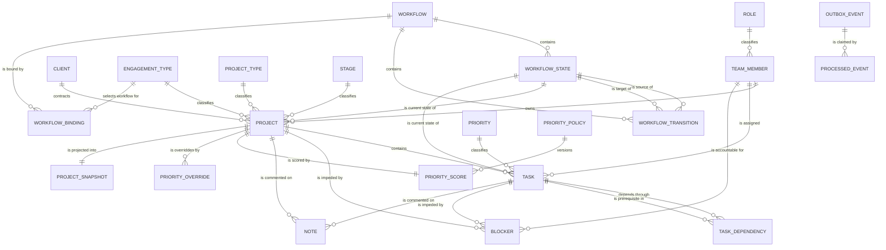

# Data model — Aztec Ops

> Schema reference. Open this before writing a migration.
> Normative source for *why*: `docs/ARCHITECTURE.md`. This file owns the *what*: tables, columns,
> constraints, indexes. If the two disagree, one of them gets fixed.

Conventions used throughout:

- Table names are Django defaults: `<app_label>_<modelname>` (`catalog_engagementtype`).
- `Null` in the field tables is the database column nullability. `blank` (form-level) is called
  out only where it differs from `null`.
- Every model has an implicit `id BIGSERIAL PRIMARY KEY` unless a different primary key is
  stated. Fixture rows carry that `id` explicitly so `loaddata` is an upsert.
- `code` columns hold stable ASCII slugs. Code compares against `code` and against
  `WorkflowState.category`. Never against `label` — labels are Spanish operator-editable data.
- Timestamps are `timestamptz`. `created_at` is `auto_now_add`, `updated_at` is `auto_now`.

Apps in dependency order: `catalog` → `accounts` → `workflow` → `portfolio` → `work` → `activity` →
`prioritization` → `events`. `events` depends on nothing; every other app writes to it.

---

## 1. `backend/apps/catalog` — taxonomies

Six tables the operation edits from the admin without a deploy (`ARCHITECTURE` §4.2). They share
an abstract base, so the first five columns are identical everywhere.

### `TaxonomyBase` (abstract, no table)

| Column | Type | Null | Default | Index | Meaning |
|---|---|---|---|---|---|
| `code` | `varchar(32)` | no | — | unique per concrete table | Stable slug. The only value logic compares against. |
| `label` | `varchar(64)` | no | — | — | Human label shown in the UI. Spanish, admin-editable. |
| `order` | `smallint` | no | `0` | part of `(is_active, order)` | Display order in menus and columns. |
| `is_active` | `boolean` | no | `true` | part of `(is_active, order)` | Soft retirement. Inactive rows keep resolving on existing FKs. |
| `color` | `varchar(7)` | no | `''` (blank) | — | Hex swatch for chips and badges, e.g. `#c2410c`. |

### `catalog_engagementtype` — how an engagement behaves commercially and in the ranking

| Column | Type | Null | Default | Index | Meaning |
|---|---|---|---|---|---|
| *(base columns)* | | | | | |
| `weight` | `numeric(4,2)` | no | `1.00` | — | Multiplier applied to the weighted score sum (`ARCHITECTURE` §4.1). Never an addend. |

Seeded rows: `proyecto`, `mantenimiento_recurrente`, `diagnostico` (12 / 6 / 4 projects in the
source). Also the join key of `WorkflowBinding`.

### `catalog_projecttype` — the dataset's `project_type_api`

Base columns only. Seeded: `automatizacion`, `consultoria`.

### `catalog_stage` — delivery stage, ordered

Base columns only. Seeded: `descubrimiento`, `ejecucion`. `order` is meaningful here: the fixture
generator maps `stage` onto the project's initial `WorkflowState` because the source `status`
column is `Activo` on all 22 rows.

### `catalog_priority` — task priority

| Column | Type | Null | Default | Index | Meaning |
|---|---|---|---|---|---|
| *(base columns)* | | | | | |
| `weight` | `numeric(4,2)` | no | `1.00` | — | Numeric severity consumed by the `criticality` signal. |
| `is_urgent` | `boolean` | no | `false` | — | Marks the codes that `criticality` counts (`critica`, `alta`) without hardcoding those codes in Python. |

Seeded: `critica` (13 tasks), `alta` (38), `media` (23), `baja` (8).

### `catalog_role` — the role a person holds

Base columns only. FK target of `accounts.User.role` (`on_delete=SET_NULL`, `related_name="members"`).

### `catalog_currency` — what a project is billed in

| Column | Type | Null | Default | Index | Meaning |
|---|---|---|---|---|---|
| *(base columns)* | | | | | |
| `minor_units` | `smallint` | no | `2` | — | ISO-4217 exponent: the decimal places the amount is written with. `0` for CLP and JPY, `2` for USD and EUR. |

`code` is the ISO-4217 **alphabetic** code in upper case, and the database enforces the shape:
`CHECK (code ~ '^[A-Z]{3}$')`, so `usd` and `EURO` are rejected at write time rather than
discovered by a client that cannot match them. `minor_units` is bounded by
`CHECK (minor_units <= 4)` — 4 is the widest exponent the standard defines (CLF).

`minor_units` is not decoration. It is the one fact a client cannot derive, and getting it wrong is
a rendering error of two orders of magnitude: `28000` is `$280.00` in USD and `$28.000` in CLP. It
is served on every currency by `GET /api/v1/catalog`, which is what lets the frontend render a
validated select and format an amount without hardcoding a list.

Seeded: `USD` (20 projects), `COP` (2), plus the regional currencies a Spanish-speaking services
operation bills in — `MXN`, `CLP`, `PEN`, `ARS`, `EUR`. Deliberately not all 180 of the standard:
a picker that lists every currency on earth is a picker nobody can use, and a value that is needed
is one admin row away.

---

## 2. `backend/apps/workflow` — configurable state machines

Four tables the operation edits **from the product**, on `/workflows`, through the ops-lead-only
authoring routes (`ARCHITECTURE` §4.3, `API.md` §2.19). The Django admin registers the same models
and remains a second door, not the only one — a lifecycle reshapeable only by somebody holding an
admin account is configurable by engineering, not by the operation. Nothing here is ever deleted:
retirement is `is_active = False`, because history and live records point at these rows.

### `workflow_workflow` — a named state graph, bound to one entity kind

| Column | Type | Null | Default | Index | Meaning |
|---|---|---|---|---|---|
| `code` | `varchar(32)` | no | — | unique | Stable slug, e.g. `project_default`, `task_default`. |
| `name` | `varchar(96)` | no | — | — | Operator-facing name, shown wherever the graph is offered. Renamed from `/workflows`. |
| `applies_to` | `varchar(8)` | no | — | part of partial unique | `PROJECT` \| `TASK`. `TextChoices` — structural, not operator data. |
| `is_default` | `boolean` | no | `false` | partial unique with `applies_to` | Fallback when no `WorkflowBinding` matches. |
| `is_active` | `boolean` | no | `true` | — | Retires a workflow without deleting its history. |
| `created_at` | `timestamptz` | no | `auto_now_add` | — | |

### `workflow_workflowstate` — a node in the graph

| Column | Type | Null | Default | Index | Meaning |
|---|---|---|---|---|---|
| `workflow_id` | `bigint` FK → `workflow_workflow` | no | — | FK index, `(workflow, order)` | Owning graph. `on_delete=PROTECT`. |
| `code` | `varchar(32)` | no | — | unique with `workflow` | Slug, unique inside its workflow only. |
| `label` | `varchar(64)` | no | — | — | Spanish UI label (`Bloqueada`, `En progreso`). |
| `category` | `varchar(16)` | no | — | `(category)` | `BACKLOG` \| `IN_PROGRESS` \| `BLOCKED` \| `DONE` \| `CANCELLED`. The closed vocabulary all logic branches on. |
| `is_initial` | `boolean` | no | `false` | partial unique per workflow | Entry node. Exactly one per workflow. |
| `is_terminal` | `boolean` | no | `false` | — | No outgoing transitions expected. |
| `is_active` | `boolean` | no | `true` | — | `false` = retired: out of the graph for new work, still resolving for anything already on it. Retirement is refused while any project or task sits on the node (`409`, `docs/API.md` §2.19) and withdraws every transition touching it. Never a delete — the FKs below are `PROTECT`, and history points at the row. |
| `order` | `smallint` | no | `0` | `(workflow, order)` | Board/column order. A state added through the API without one is **appended** after the last node of its graph. |
| `color` | `varchar(7)` | no | `''` | — | Badge color. |

### `workflow_workflowtransition` — a legal edge

| Column | Type | Null | Default | Index | Meaning |
|---|---|---|---|---|---|
| `workflow_id` | `bigint` FK → `workflow_workflow` | no | — | FK index | Owning graph; redundant with the states' workflow, kept so the "transitions of this workflow" query is one index scan. |
| `from_state_id` | `bigint` FK → `workflow_workflowstate` | no | — | `(from_state, is_active)` | Source node. `related_name="outgoing"`. |
| `to_state_id` | `bigint` FK → `workflow_workflowstate` | no | — | FK index | Target node. `related_name="incoming"`. |
| `label` | `varchar(64)` | no | — | — | Button text in the UI. The frontend never derives a label from a state code. |
| `requires_reason` | `boolean` | no | `false` | — | Transition service rejects an empty `reason` with `ReasonRequired`. |
| `requires_fields` | `jsonb` | no | `[]` | — | List of field names that must be non-empty on the aggregate, e.g. `["next_step"]`. Renders as a disabled button with the cause. |
| `guard` | `varchar(64)` | no | `''` | — | Code of a registered guard callable. Empty means no guard. |
| `is_active` | `boolean` | no | `true` | `(from_state, is_active)` | Inactive edges are invisible to the transition service. |
| `order` | `smallint` | no | `0` | — | Button order. |

An edge that does not exist here, or exists but is inactive, makes the transition illegal:
`TransitionNotAllowed`, mapped to HTTP 409. No route assigns `workflow_state` directly.

### `workflow_workflowbinding` — which workflow an engagement type follows

| Column | Type | Null | Default | Index | Meaning |
|---|---|---|---|---|---|
| `workflow_id` | `bigint` FK → `workflow_workflow` | no | — | FK index | Target graph. |
| `applies_to` | `varchar(8)` | no | — | unique with `engagement_type` | `PROJECT` \| `TASK`. Denormalized from the workflow so the lookup does not join. |
| `engagement_type_id` | `bigint` FK → `catalog_engagementtype` | **yes** | `null` | unique with `applies_to` | Null means "the default binding for this entity kind". |
| `is_active` | `boolean` | no | `true` | — | |

**Resolution order** — `Workflow.objects.resolve`, most specific first:

1. **the graph the record itself names**: `portfolio_project.workflow_id` / `work_task.workflow_id`,
   handed to `resolve` as `assigned`;
2. the active binding for the record's `engagement_type`;
3. the binding whose `engagement_type IS NULL` — the per-kind default binding;
4. `Workflow.is_default`.

Steps 2–4 are what let a Diagnostico run a shorter lifecycle than a recurring maintenance
engagement without any code change — and without an engineer, because the bindings are written from
the product when the graph is created (`API.md` §2.19). An engagement type already bound elsewhere
is refused with a `409` naming the graph holding it. Step 1 is what lets **one** Diagnostico differ
from the rest, so an exceptional engagement stops being a reason to fork the engagement type every
other project shares; it is written only by `assign_project_workflow` / `assign_task_workflow`
(`API.md` §2.20), never by an ordinary edit, and `NULL` means "whatever the binding resolves to".
Both ends of that answer are the operation's to decide, from the product.

Two properties of step 1 are load-bearing:

- **A record's own graph wins even when that graph is retired**, exactly as a retired *state* keeps
  resolving for whoever stands on it. Retirement stops a lifecycle being offered to new work, and a
  record already inside one is not new work. Refusing *arrivals* is `WorkflowRetired`, raised where
  a record is moved into a graph rather than where an existing placement is read back.
- **Creation cannot reach it.** A brand new project or task names no graph, so `create_project` and
  `create_task` behave exactly as they did before the column existed.

---

## 3. `backend/apps/accounts` + `backend/apps/portfolio` — the person, clients, projects, read model

The person lives in `accounts` and everything else in this section lives in `portfolio`. They are
documented together because every foreign key below that names a person points at
`AUTH_USER_MODEL`.

### `accounts_user` — identity, and the person work is assigned to

`AbstractUser`, so `username`, `password`, `email`, `first_name`, `last_name`, `is_active`,
`is_staff`, `is_superuser`, `last_login`, `date_joined`, `groups` and `user_permissions` are
inherited. Added on top:

| Column | Type | Null | Default | Index | Meaning |
|---|---|---|---|---|---|
| `code` | `varchar(32)` | no | — | unique | Stable slug (`camila.torres`); also the `actor` string in `ActivityRecord` and in the event envelope, and the `author` of a note. `username` mirrors it. |
| `alias` | `varchar(96)` | no | — | — | Display name from the source data (`Camila Torres`). Ordering column. |
| `role_id` | `bigint` FK → `catalog_role` | yes | `null` | FK index | `on_delete=SET_NULL`, `related_name="members"`. |
| `weekly_capacity_points` | `smallint` | no | `20` | — | Denominator of owner load, constrained `> 0`. The numerator is computed from `work_task`, never stored here. |

There is no `portfolio_teammember`. Whoever is assigned a task is whoever signs in to move it, so
they are one row (`ARCHITECTURE` §4.1). `is_active` comes from `AbstractUser` rather than being
duplicated. Seed users are created with `set_unusable_password()`: they are real assignees who
simply have no password yet.

The source `Team` sheet counters (`open_tasks_assigned`, `blocked_tasks_assigned`,
`high_or_critical_open`, `*_projects`) are **not** columns and are **not** imported. They are a
stale projection of the task rows; load is recomputed by
`portfolio.repositories.owner_load_for_codes` — the one query that spans contexts and so lives in
the context that consumes it rather than on a manager.

### `portfolio_client` — the counterparty

| Column | Type | Null | Default | Index | Meaning |
|---|---|---|---|---|---|
| `code` | `varchar(32)` | no | — | unique | Stable slug. |
| `alias` | `varchar(96)` | no | — | — | Display name. All 16 source clients are aliases invented by the challenge authors. |
| `notes` | `text` | no | `''` | — | Free context. |
| `is_active` | `boolean` | no | `true` | — | |
| `created_at` | `timestamptz` | no | `auto_now_add` | — | |

### `portfolio_project` — the aggregate root

| Column | Type | Null | Default | Index | Meaning |
|---|---|---|---|---|---|
| `code` | `varchar(16)` | no | — | unique | Business identifier (`PRJ-01`). Used in URLs, in `ActivityRecord.entity_id` and in the event envelope's `entity.id`. |
| `name` | `varchar(160)` | no | — | — | |
| `client_id` | `bigint` FK → `portfolio_client` | no | — | FK index | `on_delete=PROTECT`. |
| `engagement_type_id` | `bigint` FK → `catalog_engagementtype` | no | — | FK index | Drives the score modifier and the workflow binding. |
| `project_type_id` | `bigint` FK → `catalog_projecttype` | yes | `null` | FK index | Source `project_type_api`. |
| `stage_id` | `bigint` FK → `catalog_stage` | yes | `null` | FK index | Descubrimiento / Ejecucion. |
| `workflow_state_id` | `bigint` FK → `workflow_workflowstate` | no | — | `(is_archived, workflow_state)` | Current node. Assigned **only** by the transition service, and by `assign_project_workflow` — which repoints it at the *same state code* in another graph and never at another state, so no route can reach a state no edge leads to. `on_delete=PROTECT`. |
| `workflow_id` | `bigint` FK → `workflow_workflow` | **yes** | `null` | FK index | The lifecycle **this project** follows, when an ops lead chose one. `on_delete=PROTECT`. Null means nobody chose and the graph comes from the binding ladder below. Set, it is step 1 of that ladder and outranks the engagement type's binding. Invariant: when set it equals `workflow_state.workflow`; `Project.clean()` restates it for the admin, which is the one door that bypasses the service. |
| `owner_id` | `bigint` FK → `accounts_user` | yes | `null` | `(owner, is_archived)` | `on_delete=SET_NULL`. Null owner is itself an operational signal. |
| `start_date` | `date` | yes | `null` | — | Null on 9 source projects. Never backfilled. |
| `target_date` | `date` | yes | `null` | `(target_date)` | Null on 5 source projects, and that null raises `NO_TARGET_DATE`. Never backfilled with `today()` or a sentinel. |
| `business_value` | `numeric(12,2)` | yes | `null` | — | Contract value. Arrives as a string in the source and is cast at fixture generation. Log-normalized in the engine. |
| `currency_id` | `bigint` FK → `catalog_currency` | no | — | FK index | `on_delete=PROTECT`: a currency is referenced by history, and deleting one would rewrite what a signed contract was worth. Retire it with `is_active` instead. |
| `summary` | `text` | no | `''` | — | |
| `next_step` | `varchar(255)` | no | `''` | — | Empty string, not null, so `HasNoNextStep` is one predicate. Empty plus no in-progress task = no clear next step. |
| `is_archived` | `boolean` | no | `false` | `(is_archived, workflow_state)` | Excluded from the queue and from most risk specifications. |
| `imported_health` | `varchar(16)` | no | `''` | — | The source `health` column (`Sano` 5, `En riesgo` 4, `Bloqueado` 13). **Cross-check only.** Nothing reads it at runtime; the derived flags win. |
| `created_at` | `timestamptz` | no | `auto_now_add` | — | |
| `updated_at` | `timestamptz` | no | `auto_now` | — | |

There is no `status` column and no `health` column anywhere. Status is `workflow_state`; health is
derived on read from the risk specifications, which are pure functions of this row and its tasks,
blockers and activity ([ADR 0011](adr/0011-risk-flags-computed-on-read.md)).

`workflow_id` and `workflow_state_id` are two facts, not one, and the pair carries the invariant of
§2's step 1: `workflow_state_id` is *where the record stands* and is the enforcement truth — the
graph that owns that node is the one whose edges `validate_transition` reads — while `workflow_id`
records only that somebody chose it, so the ladder stops there. A reassignment writes both together
and keeps the state **code** unchanged, which is why the pair can never disagree and why the
operation needs no `WorkflowTransition` behind it. The detail payloads report the graph from
`workflow_state.workflow` and the `DIRECT`/`INHERITED` tag from `workflow_id`; they do not re-run
the ladder, because after a rebinding it would name a graph the record is not on.

### `portfolio_projectsnapshot` — the read model (CQRS-lite, `ARCHITECTURE` §8)

One row per project. Everything the command center renders, pre-joined, so `GET /api/v1/projects`
is a single indexed scan instead of a six-table join plus per-row aggregates.

| Column | Type | Null | Default | Index | Meaning |
|---|---|---|---|---|---|
| `project_code` | `varchar(16)` | no | — | **primary key** | Business code. Primary key so a consumer can upsert without first resolving a numeric id. |
| `project_id` | `bigint` | no | — | unique | Numeric id of the write-side row, for admin links only. Not a FK: the read side must survive the write side being rebuilt. |
| `name` | `varchar(160)` | no | — | — | |
| `client_alias` | `varchar(96)` | no | — | — | |
| `engagement_type_code` | `varchar(32)` | no | — | `(engagement_type_code)` | Filter facet. |
| `engagement_type_label` | `varchar(64)` | no | — | — | |
| `project_type_code` | `varchar(32)` | no | `''` | — | |
| `stage_code` | `varchar(32)` | no | `''` | — | |
| `state_code` | `varchar(32)` | no | — | — | |
| `state_label` | `varchar(64)` | no | — | — | |
| `state_category` | `varchar(16)` | no | — | `(state_category)` | Filter facet. |
| `owner_code` | `varchar(32)` | no | `''` | `(owner_code)` | "Show me my portfolio". |
| `owner_alias` | `varchar(96)` | no | `''` | — | |
| `owner_load_points` | `smallint` | no | `0` | — | Computed load of the owner at rebuild time. |
| `owner_capacity_points` | `smallint` | no | `0` | — | Copy of `accounts.User.weekly_capacity_points`. |
| `start_date` | `date` | yes | `null` | — | |
| `target_date` | `date` | yes | `null` | `(target_date)` | Timeline sort. |
| `business_value` | `numeric(12,2)` | yes | `null` | — | |
| `currency` | `varchar(3)` | no | `'USD'` | — | The **code**, denormalized like every other reference on this table. The read model is flat by design; the decimal places come from `GET /api/v1/catalog`. |
| `next_step` | `varchar(255)` | no | `''` | — | |
| `priority_score` | `numeric(5,2)` | no | `0` | `(is_archived, -priority_score)` | 0–100. The queue sort key. |
| `priority_policy_version` | `varchar(16)` | no | `''` | — | Which policy produced the score. |
| `breakdown` | `jsonb` | no | `{}` | — | Verbatim copy of `PriorityScore.breakdown` (§6.3). Rendered next to the number. |
| `has_override` | `boolean` | no | `false` | — | Drives the "override" badge. The computed score stays visible beside it. |
| `override_position` | `smallint` | yes | `null` | — | Forced queue position, if any. |
| `override_reason` | `varchar(255)` | no | `''` | — | Mandatory when an override exists. |
| `open_task_count` | `smallint` | no | `0` | — | |
| `overdue_task_count` | `smallint` | no | `0` | — | |
| `blocked_task_count` | `smallint` | no | `0` | — | Tasks whose state category is `BLOCKED`. |
| `urgent_open_task_count` | `smallint` | no | `0` | — | Open tasks whose `priority.is_urgent`. |
| `in_progress_task_count` | `smallint` | no | `0` | — | Tasks whose state category is `IN_PROGRESS`. Read by `HasNoNextStep` at query time; a count rather than a boolean because the aggregate produces it for free. |
| `open_blocker_count` | `smallint` | no | `0` | — | |
| `oldest_blocker_age_days` | `smallint` | yes | `null` | — | Feeds the blockers panel ordering. |
| `last_activity_at` | `timestamptz` | yes | `null` | — | Latest `ActivityRecord.occurred_at`. Drives `IsStale`. |
| `is_archived` | `boolean` | no | `false` | `(is_archived, -priority_score)` | |
| `rebuilt_at` | `timestamptz` | no | `auto_now` | — | Last rebuild. A stale value against a busy outbox means the `snapshot-builder` handler is behind. |
| `last_event_id` | `uuid` | yes | `null` | — | Envelope id of the event that produced this row. Makes a stale snapshot traceable to a specific delivery. |

---

## 4. `backend/apps/work` — tasks, dependencies, blockers, notes

### `work_task`

| Column | Type | Null | Default | Index | Meaning |
|---|---|---|---|---|---|
| `code` | `varchar(16)` | no | — | unique | Business identifier (`TSK-014`). |
| `project_id` | `bigint` FK → `portfolio_project` | no | — | `(project, workflow_state)` | `on_delete=CASCADE`. Tasks have no life outside a project. |
| `assignee_id` | `bigint` FK → `accounts_user` | yes | `null` | `(assignee, workflow_state)` | `on_delete=SET_NULL`. The owner-load numerator is computed from this column. |
| `priority_id` | `bigint` FK → `catalog_priority` | no | — | FK index | `on_delete=PROTECT`. |
| `workflow_state_id` | `bigint` FK → `workflow_workflowstate` | no | — | `(project, workflow_state)` | Assigned only by the transition service, and by `assign_task_workflow` — which repoints it at the *same state code* in another graph and never at another state. |
| `workflow_id` | `bigint` FK → `workflow_workflow` | **yes** | `null` | FK index | The lifecycle **this task** follows, when an ops lead chose one. `on_delete=PROTECT`. Null means nobody chose and the graph comes from the binding ladder. Set, it is step 1 of that ladder. Invariant: when set it equals `workflow_state.workflow`; `Task.clean()` restates it for the admin. |
| `due_date` | `date` | yes | `null` | `(due_date)` | Overdue is derived from this against `now`. The source `is_overdue` string (`Si`/`No`) is not imported. |
| `title` | `varchar(200)` | no | — | — | Also the match target for free-text dependencies. |
| `detail` | `text` | no | `''` | — | |
| `last_progress` | `varchar(255)` | no | `''` | — | Last recorded progress note from the source sheet. |
| `is_archived` | `boolean` | no | `false` | `(project, is_archived)` | Soft delete ([ADR 0012](adr/0012-soft-delete-for-tasks.md)). Named after `portfolio_project.is_archived` because it is the same fact. Written only by `update_task`, through `DELETE /tasks/{code}` or `PATCH {"is_archived": false}`. |
| `created_at` | `timestamptz` | no | `auto_now_add` | — | |
| `updated_at` | `timestamptz` | no | `auto_now` | — | |

**Removing a task never deletes the row.** `work_note.task_id` and `work_blocker.task_id` are both
`CASCADE` and `work_taskdependency.task_id` is too, so a hard delete would take the conversation,
the impediments and the prerequisite edges with it — and the append-only `activity_activityrecord`,
which holds no foreign key, would be left naming a row that is gone. The scope is applied per read
through `TaskQuerySet.active()`, never on the default manager, and three reads are deliberately
**not** scoped: `next_code_for` (a code is never reused), `TaskDependencyQuerySet.adjacency()` /
`.resolved()` (the graph keeps its removed nodes, or the cycle check could be tricked by
archive-then-restore), and `Blocker.objects.for_project(...)` (a blocker on a removed task is still
an open impediment on the project). ADR 0012 argues each one.

There is not one completed task in the source (`Por hacer` 23, `En progreso` 21, `En revision` 21,
`Bloqueada` 17). `hecha` exists in the task workflow anyway; any query that assumes a done row
exists must still be correct on this data.

### `work_taskdependency` — "this cannot start until that is done"

| Column | Type | Null | Default | Index | Meaning |
|---|---|---|---|---|---|
| `task_id` | `bigint` FK → `work_task` | no | — | `(task)` | Dependent task. `related_name="dependencies"`, `on_delete=CASCADE`. |
| `depends_on_id` | `bigint` FK → `work_task` | **yes** | `null` | `(depends_on)` | Resolved prerequisite. `related_name="dependents"`, `on_delete=SET_NULL`. |
| `raw_label` | `varchar(255)` | no | `''` | — | The original free-text value when it did not resolve. 61 of 82 source tasks carry a dependency written as a task *title*, not a code. |
| `is_resolved` | `boolean` | no | `false` | — | `depends_on IS NOT NULL`. Stored so the "unresolved dependencies" admin list is one filter. |
| `created_at` | `timestamptz` | no | `auto_now_add` | — | |

An unresolvable dependency is kept as `raw_label`, never dropped. Dropping it would silently
delete 61 rows worth of the operation's own notes.

### `work_blocker` — an open impediment, as a row

| Column | Type | Null | Default | Index | Meaning |
|---|---|---|---|---|---|
| `code` | `varchar(16)` | no | `nextval('work_blocker_code_seq')`, rendered | unique | Business identifier (`BLK-0142`). What the event envelope carries as `entity.id` (`EVENTS` §4), so a consumer names a blocker without a foreign key into `work`. Assigned on insert and never renumbered. |
| `project_id` | `bigint` FK → `portfolio_project` | no | — | partial `(project) WHERE resolved_at IS NULL` | Always set, including for task-level blockers (see §7.1). `on_delete=CASCADE`. |
| `task_id` | `bigint` FK → `work_task` | yes | `null` | FK index | Set when the blocker was raised on a specific task. |
| `description` | `text` | no | — | — | Prose from the source, or what the operator typed. |
| `kind` | `varchar(24)` | no | — | `(kind)` | `EXTERNAL_DEPENDENCY` \| `ACCESS` \| `DECISION` \| `TECHNICAL`. `TextChoices` — structural, not operator-editable. |
| `raised_at` | `timestamptz` | no | `auto_now_add` | `(raised_at)` | Age of the oldest open blocker drives the `blockage` signal. |
| `resolved_at` | `timestamptz` | yes | `null` | partial index above | Null means open. Openness is this column, never a substring match on prose. |
| `owner_id` | `bigint` FK → `accounts_user` | yes | `null` | FK index | Who is expected to clear it. |
| `resolution_reason` | `varchar(255)` | no | `''` | — | Required by the service when resolving; copied into the `ActivityRecord`. |

### `work_note` — chronological comment

| Column | Type | Null | Default | Index | Meaning |
|---|---|---|---|---|---|
| `code` | `varchar(16)` | no | `nextval('work_note_code_seq')`, rendered | unique | Business identifier (`NOTE-0391`), the envelope's `entity.id` for `note.added`. Same rule as `Blocker.code`: assigned on insert, never renumbered. |
| `project_id` | `bigint` FK → `portfolio_project` | no | — | `(project, -created_at)` | Always set, same rule as `Blocker`. |
| `task_id` | `bigint` FK → `work_task` | yes | `null` | FK index | Set for task-scoped notes. |
| `body` | `text` | no | — | — | |
| `author` | `varchar(32)` | no | — | — | `accounts.User.code`, or `system`. Denormalized string, not a FK: a note must survive its author leaving the roster. |
| `created_at` | `timestamptz` | no | `auto_now_add` | `(project, -created_at)` | |

### Sequences behind `Blocker.code` and `Note.code`

Two PostgreSQL sequences, `work_blocker_code_seq` and `work_note_code_seq`, both created by
raw SQL in `work.0001_initial` with a matching `reverse_sql` that drops them. They live in the
same migration as the tables because `makemigrations` cannot author a sequence — no model state
describes one — so a hand-written operation kept apart from the tables it serves is the one that
gets lost the next time the migration set is regenerated. The value is
drawn with `nextval` in the model's `save()` on insert and rendered as `BLK-` / `NOTE-` plus the
number zero-padded to four digits — a floor, not a limit, so the ten-thousandth row is `BLK-10000`.

A sequence and not `max(pk) + 1` and not a Python counter, because both of those read a value,
decide, then write: two concurrent inserts compute the same number and the second dies on the
unique constraint, or silently reuses a code if the constraint is ever missing. `nextval` is
atomic and non-transactional, so it never hands the same number to two callers. Its counterpart is
that a rolled-back insert burns its number; that gap is kept, because codes are never reused and
never renumbered — a trail that renumbers is not a trail. Only the code is immutable: unlike
`ActivityRecord`, these rows *are* updated (a blocker is resolved by writing `resolved_at`), so
neither `save()` refuses an update.

`loaddata` bypasses `save()`, so fixture rows must carry their own `code` and the sequences must be
advanced past the seeded values.

---

## 5. `backend/apps/activity` — the audit trail

### `activity_activityrecord` — append-only, never updated, never deleted

| Column | Type | Null | Default | Index | Meaning |
|---|---|---|---|---|---|
| `entity_type` | `varchar(16)` | no | — | `(entity_type, entity_id, -occurred_at)` | `project` \| `task` \| `blocker` \| `member` \| `role`. The last two are the roster and the role vocabulary, which are editable from the product and therefore auditable like everything else. |
| `entity_id` | `varchar(32)` | no | — | same composite | The **business code** (`PRJ-01`), matching `entity.id` in the event envelope, not a numeric primary key. |
| `verb` | `varchar(24)` | no | — | `(verb, -occurred_at)` | `CREATED`, `STATE_CHANGED`, `PRIORITY_CHANGED`, `BLOCKER_RAISED`, `BLOCKER_RESOLVED`, `OWNER_CHANGED`, `NEXT_STEP_SET`, `TASK_ADDED`, `NOTE_ADDED`, `SEEDED`, `RENAMED`, `ROLE_CHANGED`, `CAPACITY_CHANGED`, `DEACTIVATED`, `REACTIVATED`, `PASSWORD_RESET`. There is deliberately no generic `UPDATED`: each verb names *which* fact moved, so filtering on `CAPACITY_CHANGED` returns exactly the decisions that changed what "overloaded" means. |
| `origin` | `varchar(8)` | no | `'SYSTEM'` | — | `MANUAL` (a human forced it; `reason` mandatory) \| `POLICY` (the engine recomputed; `metadata` names the signal that moved) \| `SYSTEM`. |
| `actor` | `varchar(32)` | no | — | `(actor, -occurred_at)` | `accounts.User.code`, or `system` when the engine caused the change. |
| `from_value` | `varchar(255)` | no | `''` | — | Point-in-time copy of the previous value, as text. |
| `to_value` | `varchar(255)` | no | `''` | — | Point-in-time copy of the new value, as text. |
| `reason` | `varchar(500)` | no | `''` | — | Mandatory when the transition or the override requires it. |
| `metadata` | `jsonb` | no | `{}` | — | Verb-specific extras: `{"blocker_id": 12, "kind": "ACCESS"}`, `{"signal": "blockage", "delta": 8.4}`. |
| `occurred_at` | `timestamptz` | no | `timezone.now` at write | composite indexes above | Domain time, set by the service, not by the database. Fixtures pin it so seeds are deterministic. |
| `correlation_id` | `uuid` | no | — | `(correlation_id)` | Chains "deprioritize A in order to prioritize B" into one movement. |

**No `updated_at`, and that is deliberate.** The table is append-only: `save()` on an existing row
raises, `delete()` raises, and the admin returns `False` from `has_change_permission` and
`has_delete_permission`. An `updated_at` column would advertise a mutation path that must not
exist, and a reviewer seeing one would reasonably stop trusting the trail. Correcting a record
means appending a new one. `occurred_at` is not a row-lifecycle timestamp either — it is when the
fact happened in the domain, which is why a consumer replaying an event does not shift it.

The project timeline in `/projects/{code}` is exactly
`ActivityRecord.objects.filter(entity_type="project", entity_id=code).order_by("-occurred_at")`.

> The `write_activity(...)` snippet in `.agents/skills/django-clean-arch/SKILL.md` passes a numeric
> `blocker.project_id`. That is shorthand in the example; the column holds the business code. Fix
> the snippet when you next touch it rather than widening the column.

---

## 6. `backend/apps/prioritization` — score and override (risk flags are computed, not stored)

### 6.1 `prioritization_prioritypolicy` — the versioned criterion

| Column | Type | Null | Default | Index | Meaning |
|---|---|---|---|---|---|
| `version` | `varchar(16)` | no | — | unique | `v1`, `v2`. Immutable once a score has been written with it. |
| `is_active` | `boolean` | no | `false` | partial unique `WHERE is_active` | Exactly one active policy. |
| `weights` | `jsonb` | no | — | — | `{"deadline_pressure": 0.25, "overdue_work": 0.20, ...}`. Keys are registered signal codes; values sum to 1.0. |
| `modifiers` | `jsonb` | no | `{}` | — | Multiplicative adjustments, currently `{"engagement_type": true}`. |
| `notes` | `text` | no | `''` | — | Why this version differs from the previous one. |
| `created_at` | `timestamptz` | no | `auto_now_add` | — | |

Changing weights means inserting a **new** version and moving `is_active`. Editing the active row
silently rewrites the meaning of every score already persisted against it.

### 6.2 `prioritization_priorityscore` — the current computed score, one row per project

| Column | Type | Null | Default | Index | Meaning |
|---|---|---|---|---|---|
| `project_id` | `bigint` **OneToOne** → `portfolio_project` | no | — | unique | `on_delete=CASCADE`. |
| `value` | `numeric(5,2)` | no | — | `(-value)` | 0–100. |
| `policy_version` | `varchar(16)` | no | — | `(policy_version)` | Copied, not a FK: the score must stay readable if the policy row is retired. |
| `breakdown` | `jsonb` | no | — | — | Per-signal reasons. Shape in §6.3. |
| `modifier_total` | `numeric(4,2)` | no | `1.00` | — | Product of the applied modifiers, so `value` is reconstructible from `breakdown`. |
| `computed_at` | `timestamptz` | no | — | — | Set by the recalculator, not `auto_now`, so a replay does not invent a new time. |
| `input_hash` | `varchar(64)` | no | `''` | — | Hash of the `SignalInput` that produced the value. Equal hash plus equal `policy_version` means recomputation is a no-op — this is what makes the recalculator cheap under at-least-once delivery. |
| `valid_until` | `timestamptz` | yes | `null` | `(valid_until)` | The earliest future instant at which a time-dependent signal changes bucket — the target date, the start of the final week, or the staleness threshold, whichever comes first. Null means no time signal can move on its own. This is what `clock.ticked` selects on. |

**Why `valid_until` exists.** `deadline_pressure` and `staleness` are functions of *now*, so a
score can go stale with no event to trigger a recompute. The `ticker` service emits `clock.ticked`
on an interval and the recalculator selects `WHERE valid_until <= tick_at`, recomputing only the
projects whose clock actually moved. Recomputing all 22 rows every tick would also work at this
size and would be the wrong shape at any other; the index on `valid_until` makes a quiet tick cost
one scan and produce nothing.

**Score history is not kept here.** One row per project, overwritten on recompute. Every change is
already appended to `ActivityRecord` with verb `PRIORITY_CHANGED`, `from_value`, `to_value` and the
signal that moved in `metadata`. A second history table would be a duplicate that can disagree with
the audit trail.

### 6.3 `breakdown` JSON shape

An object with a fixed top level and one entry per **registered** signal — a signal present in
`weights` with no registered strategy (or the reverse) raises at policy load, so `signals` always
covers the policy exactly.

```json
{
  "policy_version": "v2",
  "value": 84.0,
  "base": 76.4,
  "modifier_total": 1.1,
  "signals": [
    {
      "code": "deadline_pressure",
      "label": "Presión de fecha",
      "raw": 1.0,
      "weight": 0.25,
      "contribution": 25.0,
      "reason": "La fecha objetivo 2026-07-22 pasó hace 6 día(s)."
    },
    {
      "code": "blockage",
      "label": "Bloqueo",
      "raw": 0.9,
      "weight": 0.15,
      "contribution": 13.5,
      "reason": "1 bloqueo(s) abierto(s); el más antiguo lleva 19 día(s) sin resolverse y necesita intervención."
    },
    {
      "code": "overdue_work",
      "label": "Trabajo vencido",
      "raw": 0.57,
      "weight": 0.20,
      "contribution": 11.4,
      "reason": "4 de 7 tareas abiertas pasaron su fecha."
    },
    {
      "code": "criticality",
      "label": "Criticidad",
      "raw": 0.6,
      "weight": 0.15,
      "contribution": 9.0,
      "reason": "3 tarea(s) abierta(s) de prioridad urgente."
    },
    {
      "code": "business_value",
      "label": "Valor de negocio",
      "raw": 0.72,
      "weight": 0.15,
      "contribution": 10.8,
      "reason": "Valor de contrato 28.000,00 USD, normalizado logarítmicamente contra el máximo del portafolio (50.000,00)."
    },
    {
      "code": "staleness",
      "label": "Inactividad",
      "raw": 0.67,
      "weight": 0.10,
      "contribution": 6.7,
      "reason": "Sin actividad registrada durante 10 día(s) frente a un umbral de 14 día(s); hay próximo paso definido."
    }
  ],
  "modifiers": [
    {
      "code": "engagement_type",
      "factor": 1.1,
      "reason": "El tipo de engagement proyecto pesa 1.10."
    }
  ],
  "flags": ["OWNER_OVERLOADED"],
  "computed_at": "2026-07-28T06:12:44Z"
}
```

Invariants the recalculator asserts before writing: `contribution == round(raw * weight * 100, 2)`,
`base == sum(contribution)`, `value == round(base * modifier_total, 2)` clamped to `[0, 100]`, and
`sum(weight) == 1.0`. `reason` must name the fact — the days, the counts, the dates — never restate
the number.

`label` and `reason` are written in the interface's language and **stored with the line**, not
resolved from the signal registry when the document is read. That freezes the wording of the day
into history on purpose: `reason` states facts that were only true at `computed_at`, so a caption
re-resolved today would head those sentences with whatever the signal is called now — or with
nothing at all, once a signal is retired and its code no longer resolves. A row written before
`label` existed is the one exception and is captioned from the registry on read, falling back to the
bare `code`; it is never dropped, because a missing line is a contribution silently removed from the
argument. Note that neither wording is part of `input_hash`, so a change to a sentence alone does
not make a recompute rewrite the row — see [RUNBOOK](RUNBOOK.md) for forcing one.

`flags` is a denormalized copy of the risk flag codes at computation time so the UI can
render "the score is real, the owner is the constraint" without a second query. It is a snapshot of
what the specifications said at `computed_at`, not a source of truth: flags are computed on read
([ADR 0011](adr/0011-risk-flags-computed-on-read.md)), so a client that needs the current set reads
`risk_flags` on the project payload rather than this array.

To justify a rank, sort `signals` by `contribution` descending and read the top two or three, then
the modifiers and flags. If the breakdown does not explain the number, the breakdown is the bug.

### 6.4 `prioritization_priorityoverride` — the human forcing a position

| Column | Type | Null | Default | Index | Meaning |
|---|---|---|---|---|---|
| `project_id` | `bigint` FK → `portfolio_project` | no | — | partial unique `WHERE revoked_at IS NULL AND ...` | `on_delete=CASCADE`. |
| `position` | `smallint` | yes | `null` | — | Forced absolute position in the queue. |
| `boost` | `numeric(5,2)` | yes | `null` | — | Additive nudge applied at read time. Exactly one of `position` / `boost` is set. |
| `reason` | `varchar(500)` | no | — | check `length > 0` | Mandatory. A forced position with no recorded reason is indistinguishable from a bug three weeks later. |
| `actor` | `varchar(32)` | no | — | — | Who forced it. |
| `expires_at` | `timestamptz` | yes | `null` | `(expires_at)` | Null means until revoked. |
| `revoked_at` | `timestamptz` | yes | `null` | partial unique above | |
| `created_at` | `timestamptz` | no | `auto_now_add` | — | |

The override is **never** written into `PriorityScore.value`. The computed score stays visible next
to it, the UI labels the row as an override, and revoking restores the ranking with no recompute.

### 6.5 There is no risk flag table

There used to be `prioritization_riskflag`, one row per raised flag, cleared rather than deleted.
It is gone ([ADR 0011](adr/0011-risk-flags-computed-on-read.md)).

Every one of the six conditions — `BLOCKED`, `OVERDUE`, `NO_NEXT_STEP`, `NO_TARGET_DATE`, `STALE`,
`OWNER_OVERLOADED` — is a pure function of rows that already exist, over a clock: overdue is
`due_date < today`, stale is `last_activity < now - N days`. Storing that bought a `WHERE` clause
and cost invalidation, and two of the six changed with no event at all, so the stored copy was
wrong from midnight until whenever the next tick reconciled it. The specifications
(`ARCHITECTURE` §5) are unchanged and unpersisted: they run when the flags are read, from the write
side for a project detail and from the `portfolio_projectsnapshot` row for the queue.

The score is the deliberate exception and stays in §6.3 — not for speed, but because
`ActivityRecord` records `PRIORITY_CHANGED` with a before and an after, and a derived value with no
stored previous value has no before, no event and no live push.

`Severity` (`LOW | MEDIUM | HIGH | CRITICAL`) and the flag codes survive as domain vocabulary in
`prioritization.domain.types`; they name no column.

---

## 7. `backend/apps/events` — the bus

Both tables live in one app because they are one concern: getting a committed fact out of
PostgreSQL and applying it exactly once per handler. Celery is the transport
([ADR 0010](adr/0010-celery-as-the-bus.md)); these two tables are the durability and the
idempotency, and neither changed when the transport did.

### 7.1 `events_outboxevent` — the transactional outbox

Written by application services inside the same `transaction.atomic()` block as the aggregate
mutation and the `ActivityRecord`. Nothing else writes it, and no service imports Redis.

| Column | Type | Null | Default | Index | Meaning |
|---|---|---|---|---|---|
| `id` | `uuid` | no | `uuid4` | **primary key** | The envelope's `id`. Generated in the service so the value is known before commit and is what consumers deduplicate on. |
| `topic` | `varchar(64)` | no | — | `(topic, -occurred_at)` | `project.state_changed`, etc. Documented in `ARCHITECTURE` §6; an undocumented topic does not exist. |
| `entity_type` | `varchar(16)` | no | — | `(entity_type, entity_id)` | `project` \| `task` \| `blocker`. |
| `entity_id` | `varchar(32)` | no | — | same composite | Business code (`PRJ-01`), never a primary key — consumers in other contexts must not need a FK into your models. |
| `payload` | `jsonb` | no | `{}` | — | Topic-specific body. New fields go here, not at the envelope's top level. |
| `actor` | `varchar(32)` | no | — | — | |
| `correlation_id` | `uuid` | no | — | `(correlation_id)` | Same value as the `ActivityRecord` written in the same transaction. |
| `version` | `smallint` | no | `1` | — | Payload schema version. Bumped when a field is removed or retyped. |
| `occurred_at` | `timestamptz` | no | — | claim index below | Domain time. Publication order is by `(occurred_at, id)`. |
| `created_at` | `timestamptz` | no | `auto_now_add` | — | Row time. Differs from `occurred_at` on backfills. |
| `published_at` | `timestamptz` | yes | `null` | **partial claim index** | Set by `events.drain_outbox` inside the claiming transaction, meaning "dispatched to its handlers". Null = not yet dispatched. |
| `attempts` | `smallint` | no | `0` | — | Handler delivery attempts. Incremented on failure. |
| `last_error` | `varchar(500)` | no | `''` | — | Last delivery failure, visible in the admin. |
| `dead_lettered_at` | `timestamptz` | yes | `null` | `events_outbox_deadletter_idx` | Set when a handler exhausted `EVENT_MAX_ATTEMPTS`. The row **is** the dead letter. |

**The dead letter queue is a column, not a second queue.** Past the retry budget,
`dead_lettered_at` and `last_error` are set on the row that already exists — nothing is copied and
nothing is deleted, so the failed event still carries its topic, payload and correlation id. The
admin filters pending / dispatched / dead-lettered and offers "Re-queue selected dead-lettered
events", which clears `dead_lettered_at` and resets `published_at` so the next drain re-dispatches
the same envelope with the same `event.id`. That action is what replaced Redis stream replay, and it
is narrower: you re-queue the rows you chose.

`stream_entry_id` was dropped in `events/migrations/0002_celery_transport.py`. There is no stream
entry to point at.

### 7.2 `events_processedevent` — handler deduplication

| Column | Type | Null | Default | Index | Meaning |
|---|---|---|---|---|---|
| `event_id` | `uuid` | no | — | unique with `handler` | The envelope `id`. Not a FK to `OutboxEvent`: the table must stay prunable independently of the outbox. |
| `handler` | `varchar(48)` | no | — | same unique | The **registry name** of the reactor: `priority-recalculator` \| `snapshot-builder` \| `sse-fanout`. The same event is legitimately processed once per handler. Renaming a deployed handler replays history for it, so the name is released API. |
| `processed_at` | `timestamptz` | no | `auto_now_add` | `(processed_at)` | Retention sweep key. |

The handler inserts this row and does its work in one transaction. A duplicate hits the unique
constraint, raises `IntegrityError`, is logged and acked — the entry must be acked on the duplicate
path too, or it stays pending forever.

> Naming note: `.agents/skills/aztec-local-dev/SKILL.md` refers to these models as `apps.bus.models`
> and `.claude/agents/event-bus-engineer.md` writes `ProcessedEvent(event_id=..., group=...)`.
> The app is `backend/apps/events` and the column is `consumer_group`. Fix those two references when you
> next touch them.

---

## 8. Relationships



Two edges in that diagram are deliberately **not** database foreign keys:

- `PROJECT_SNAPSHOT` holds `project_code` and `project_id` as plain columns. The read side is
  rebuildable from events and must not be coupled to the write side's row lifetime.
- `PROCESSED_EVENT.event_id` and `PRIORITY_SCORE.policy_version` are copies. The dedup table is
  pruned on its own schedule; a persisted score must stay readable after its policy is retired.

Cross-context reads follow the same rule as code (`ARCHITECTURE` §7): a context never gains a
hidden FK into another context's internals. `work` → `portfolio` and `prioritization` → `portfolio`
are real FKs because `Project` is the published aggregate root; nothing points *into* `work` from
outside.

---

## 9. Constraints

### 9.1 Unique

| Table | Constraint | Purpose |
|---|---|---|
| every `catalog_*` | `UNIQUE (code)` | The slug is the contract with the code. |
| `workflow_workflow` | `UNIQUE (code)` | |
| `workflow_workflow` | `UNIQUE (applies_to) WHERE is_default` | One fallback per entity kind. |
| `workflow_workflowstate` | `UNIQUE (workflow_id, code)` | A state code is unique inside its graph, not globally — two workflows may both have `bloqueada`. |
| `workflow_workflowstate` | `UNIQUE (workflow_id) WHERE is_initial` | Exactly one entry node. |
| `workflow_workflowtransition` | `UNIQUE (from_state_id, to_state_id)` | One edge per ordered pair. Re-enabling is `is_active = true`, not a second row. |
| `workflow_workflowbinding` | `UNIQUE (applies_to, engagement_type_id)` | One binding per engagement type per entity kind; the null row is the per-kind default. |
| `accounts_user` / `portfolio_client` / `portfolio_project` | `UNIQUE (code)` | |
| `portfolio_projectsnapshot` | `PRIMARY KEY (project_code)`, `UNIQUE (project_id)` | One snapshot per project; the upsert key is the business code. |
| `work_task` | `UNIQUE (code)` | |
| `work_blocker` | `UNIQUE (code)` | `BLK-0142` is what the event envelope publishes as `entity.id`; two rows answering to one code would make an event ambiguous. |
| `work_note` | `UNIQUE (code)` | Same, for `NOTE-0391`. |
| `work_taskdependency` | `UNIQUE (task_id, depends_on_id) WHERE depends_on_id IS NOT NULL` | No duplicate resolved edges. Unresolved rows repeat freely — the same prose can appear twice. |
| `prioritization_prioritypolicy` | `UNIQUE (version)`, `UNIQUE ((true)) WHERE is_active` | One active policy at a time. |
| `prioritization_priorityscore` | `UNIQUE (project_id)` | Current score only. |
| `prioritization_priorityoverride` | `UNIQUE (project_id) WHERE revoked_at IS NULL` | One live override per project. |
| `events_outboxevent` | `PRIMARY KEY (id)` | The envelope id is the identity. |
| `events_processedevent` | `UNIQUE (event_id, consumer_group)` | The idempotency key. This constraint *is* the deduplication mechanism, not a safety net over one. |

### 9.2 Check constraints in the database

| Table | Constraint | Rule |
|---|---|---|
| `catalog_engagementtype`, `catalog_priority` | `weight > 0` | A zero weight would silently delete a signal's effect. |
| `catalog_currency` | `code ~ '^[A-Z]{3}$'` | ISO-4217 alphabetic code. The taxonomy is interoperable vocabulary, not an operator-invented slug. |
| `catalog_currency` | `minor_units <= 4` | 4 is the widest exponent the standard defines (CLF). A larger one renders an amount nobody can reconcile. |
| `portfolio_project` | `start_date IS NULL OR target_date IS NULL OR start_date <= target_date` | Nulls allowed on purpose; an inverted pair is data corruption. |
| `portfolio_project` | `business_value IS NULL OR business_value >= 0` | |
| `accounts_user` | `weekly_capacity_points > 0` | It is a divisor. |
| `work_taskdependency` | `depends_on_id IS NOT NULL OR raw_label <> ''` | A dependency row that points nowhere and says nothing is noise. |
| `work_taskdependency` | `depends_on_id IS NULL OR depends_on_id <> task_id` | Self-dependency. The only cycle a `CHECK` can catch. |
| `work_blocker` | `resolved_at IS NULL OR resolved_at >= raised_at` | |
| `work_blocker` | `resolved_at IS NULL OR resolution_reason <> ''` | Closing a blocker without saying how is how blockers come back. |
| `prioritization_priorityscore` | `value BETWEEN 0 AND 100` | The score's stated range. |
| `prioritization_priorityoverride` | `num_nonnulls(position, boost) = 1` | Exactly one override mechanism per row. |
| `prioritization_priorityoverride` | `length(trim(reason)) > 0` | Mandatory reason, enforced where it cannot be forgotten. |
| `events_outboxevent` | `attempts >= 0` | The only check on this table. The old `published_at IS NULL OR stream_entry_id <> ''` was dropped with the stream (`events/migrations/0002_celery_transport.py`): there is no entry id to prove anything with, and `published_at` now means "dispatched". |

### 9.3 Enforced in the application layer, and why

| Rule | Where it lives | Why not in the database |
|---|---|---|
| `Blocker.task.project_id == Blocker.project_id`; same for `Note` | `backend/apps/work/services/` | A cross-row check needs a trigger. `project_id` is written by the service from the task, so a divergence requires bypassing the service, and the tests cover that path. |
| `TaskDependency.depends_on` is in the same project as `task` | `backend/apps/work/services/`, and the fixture generator, which only matches titles within a project | Same cross-row problem; a trigger here would also fire on every seed row. |
| The dependency graph is acyclic | `backend/apps/work/domain/` — reachability check before insert | Cycle detection is a recursive traversal. A `CHECK` cannot express it and a trigger doing a `WITH RECURSIVE` on every insert is a cost paid on 82 rows to catch a case the service already rejects. |
| `WorkflowTransition.from_state.workflow_id == to_state.workflow_id == workflow_id` | `backend/apps/workflow/services/`, plus a model `clean()` so the admin refuses it | Cross-row again. The authoring routes make a cross-graph edge inexpressible — both endpoints are resolved *inside* the workflow in the path (`API.md` §2.19) — and `clean()` catches it on the admin's second door with a readable message. |
| A project's `workflow_state` belongs to the workflow its `WorkflowBinding` resolves to | transition service | The state's workflow is two joins away. Enforcing it in the database would also block the legitimate migration path when a binding is repointed. |
| A state change follows an active `WorkflowTransition` | transition service, raising `TransitionNotAllowed` | The legal set is a table, not a column value. This is the single rule the whole workflow design exists for; putting a weaker version of it in a `CHECK` would suggest the service check is optional. |
| `requires_reason` / `requires_fields` on a transition | transition service, raising `ReasonRequired` / `MissingRequiredFields` | The required fields are a JSONB list read at runtime. A `CHECK` cannot dereference it. |
| `PriorityPolicy.weights` keys match the signal registry and sum to 1.0 | policy load in `backend/apps/prioritization/domain/` | Postgres cannot know which strategies are registered in the Python process. Loading raises rather than silently defaulting a missing weight to zero. |
| `ActivityRecord` is append-only | `save()`/`delete()` overrides on the model, `has_change_permission` / `has_delete_permission` returning `False` in the admin | Making it truly immutable needs a `BEFORE UPDATE OR DELETE` trigger and a role that cannot `DROP` it. That is real database administration, out of scope here (`ARCHITECTURE` §12); the two Python-level blocks cover every path the application has. |
| `Project.health` is derived, never stored | the risk specifications, evaluated on every read | There is no column to constrain. That is the point ([ADR 0011](adr/0011-risk-flags-computed-on-read.md)). |
| A resolved `Blocker` clears the project's `BLOCKED` risk flag | nothing — it is not a rule, it is arithmetic | The flag *is* "an open blocker exists". Resolving the last one clears it by definition on the next read; there is no derived row to reconcile and therefore nothing that can fall out of step. |
| Task `due_date` may fall after the project `target_date` | nothing enforces it | Real portfolio data does this constantly. Rejecting it would make the seed unloadable and would hide the overdue signal instead of surfacing it. |

---

## 10. Index strategy

Every index below exists for a named query. An index without one gets deleted.

### 10.1 The prioritized queue read — `GET /api/v1/projects`

```sql
SELECT * FROM portfolio_projectsnapshot
WHERE is_archived = false
ORDER BY priority_score DESC
LIMIT 25;
```

- `portfolio_projectsnapshot (is_archived, priority_score DESC)` — the whole command center in one
  index scan. `is_archived` leads because it is the constant predicate; `priority_score DESC`
  matches the sort so there is no sort node.
- `portfolio_projectsnapshot (state_category)`, `(engagement_type_code)`, `(owner_code)` — three of
  the filter facets on that same list. Each is selective enough on 22 rows to be pointless today
  and correct at 10x, which is the size this table is designed to survive.
- **`?health=` and `?risk_flag=` have no index and cannot have one.** Both are derived on read
  ([ADR 0011](adr/0011-risk-flags-computed-on-read.md)), so there is no column to index; the GIN
  index on `risk_flags` was dropped with the column. `read_queue` evaluates the ordered match and
  filters it in Python. That is a full scan of the filtered set, which is free at this size and is
  the first thing to revisit — as a materialized view, not as a hand-maintained table — if the
  portfolio ever becomes a thousand projects.
- `work_blocker (project_id) WHERE resolved_at IS NULL` — the open-blockers panel and the `blockage`
  signal's input. Partial, because a resolved blocker is never read by either.

The write-side equivalent (`portfolio_project` joined to scores, flags, tasks and blockers) exists
only in the admin and in the recompute service. It is not indexed for latency, and that is the
trade the read model buys.

### 10.2 The project timeline read — `GET /api/v1/projects/{code}/timeline`

```sql
SELECT * FROM activity_activityrecord
WHERE entity_type = 'project' AND entity_id = 'PRJ-01'
ORDER BY occurred_at DESC
LIMIT 50;
```

- `activity_activityrecord (entity_type, entity_id, occurred_at DESC)` — the timeline. The leading
  pair is the equality predicate, the trailing column is the sort, so the `LIMIT` stops after 50
  index entries no matter how large the table grows. This is the one index that must not be dropped:
  `ActivityRecord` is the only append-only table here and is the fastest growing.
- `activity_activityrecord (correlation_id)` — expands "deprioritize A to prioritize B" from either
  half into the whole movement.
- `activity_activityrecord (verb, occurred_at DESC)` — the admin's per-verb audit view and the
  reprioritization report.
- `activity_activityrecord (actor, occurred_at DESC)` — "what did this person change".
- `work_task (project_id, workflow_state_id)` — the detail view's task list grouped by state, and
  the per-project task counts in the rebuild.
- `work_task (project_id, is_archived)` — the leading pair of every task read in the product: the
  list, the board and the counts aggregate are all one project's unremoved tasks (ADR 0012).
- `work_note (project_id, created_at DESC)` — the notes section of the same page.

### 10.3 The outbox drain claim query

```sql
SELECT * FROM events_outboxevent
WHERE published_at IS NULL
ORDER BY occurred_at, id
LIMIT 100
FOR UPDATE SKIP LOCKED;
```

- `events_outboxevent (occurred_at, id) WHERE published_at IS NULL` — **partial on purpose**. The
  unpublished set is the drain's working set and is nearly always tiny; the published set is the
  whole history and is never scanned by this query. A full index on `published_at` would keep every
  published row in the index and grow monotonically for no reader. As rows are published they leave
  the index, so its size tracks the backlog rather than the table.
- The `ORDER BY` matches the index so `SKIP LOCKED` hands each worker a disjoint prefix and several
  drains can run without coordination — which is also why the on-commit kick and the Beat sweep
  cannot collide.
- `events_outboxevent (topic, occurred_at DESC)` and `(entity_type, entity_id)` — admin
  investigation only ("what did we dispatch for PRJ-01"), not on the drain's hot path.
- `events_outboxevent (correlation_id)` — joins a dispatched event back to its `ActivityRecord`.
- `events_outbox_deadletter_idx` on `dead_lettered_at` — the admin filter and the outbox admin (`/admin/events/outboxevent/`).

Diagnostic that depends on this index: a growing count of rows matching `published_at IS NULL`
means the worker is down or behind. Zero such rows with a stale UI means the service never wrote the
outbox row, which is a service bug, not a transport bug. the outbox admin (`/admin/events/outboxevent/`) is exactly these counts.

### 10.4 Handler deduplication

```sql
INSERT INTO events_processedevent (event_id, handler, processed_at) VALUES (...);
-- IntegrityError => already applied by this handler => return "duplicate", no reprocessing
```

- `events_processedevent UNIQUE (event_id, handler)` — this unique index is both the lookup and the
  enforcement. The transport does not `SELECT` first: a check-then-insert is a race between two
  workers holding the same delivery, whereas the insert either succeeds or raises, atomically,
  inside the same transaction as the handler's own writes.
- Column order matters: `event_id` leads because it is always an equality on a high-cardinality
  UUID, so the index is selective on its first column alone.
- `events_processedevent (processed_at)` — the retention sweep that deletes rows older than the
  outbox retention window. Without a sweep this table outgrows every other one; without the index
  the sweep becomes a sequential scan. **The sweep is not built yet** — an acknowledged debt
  ([ADR 0010](adr/0010-celery-as-the-bus.md)).

---

## 11. Denormalization register

Every value below is stored twice on purpose. Each line names the writer, because a denormalized
field with no named owner is a field that goes stale silently.

| Field | Source of truth | Rebuilt by | Trigger |
|---|---|---|---|
| all of `portfolio_projectsnapshot` | `Project` + `Task` + `Blocker` + `PriorityScore` + `ActivityRecord` | `snapshot-builder` handler, `backend/apps/portfolio/handlers.py` | every topic except `clock.ticked`; `task.*` and `blocker.*` events resolve to their project through `payload.project_code` |
| `projectsnapshot.priority_score`, `priority_policy_version`, `breakdown` | `prioritization_priorityscore` | `snapshot-builder`, after `priority-recalculator` emits `project.priority.recalculated` | `project.priority.recalculated` |
| `projectsnapshot.owner_load_points` | `Task` rows assigned to the owner | `snapshot-builder` | any `task.*` event; the load of **every** snapshot owned by that person is recomputed, not just the event's project |
| `projectsnapshot.last_activity_at` | `activity_activityrecord.occurred_at` | `snapshot-builder` | every event |
| `priorityscore.breakdown.flags` | the risk specifications, evaluated during scoring | `priority-recalculator` | recomputation. A point-in-time copy, like `ActivityRecord`'s — the current set is computed on read and never taken from here |
| `priorityscore.policy_version` | `prioritization_prioritypolicy.version` | never — frozen copy | written once, at computation |
| `work_blocker.project_id` on a task-level blocker | `work_task.project_id` | never — written by the service at creation | a blocker cannot change project |
| `work_note.project_id` on a task-level note | `work_task.project_id` | never | same |
| `work_taskdependency.is_resolved` | `depends_on_id IS NOT NULL` | the service and the fixture generator, on write | dependency resolution |
| `workflow_workflowbinding.applies_to` | `workflow_workflow.applies_to` | never — validated in `clean()` | binding creation |
| `workflow_workflowtransition.workflow_id` | `from_state.workflow_id` | never — validated in `clean()` | transition creation |
| `activity_activityrecord.from_value` / `to_value` / `metadata` | the aggregate, at that instant | **never** | point-in-time by definition; rebuilding them would destroy the audit trail |
| `portfolio_project.imported_health` | the source spreadsheet | never | cross-check only, read by nothing at runtime |

`ActivityRecord`'s copies are the one case that must never be refreshed. Everything else is a cache
with a consumer behind it; those three columns are the record of what was true when the decision was
made.

---

## 12. `WorkflowState.category` next to `code`

They answer different questions and both are needed.

`code` is identity: it is unique within a workflow, it is what a fixture and an API payload name
(`{"to_state": "bloqueada"}`), and it is what an operator effectively chooses when adding a state
on `/workflows`. It is open-ended — the whole point of `ARCHITECTURE` decision 6 is that the
operation adds states without a deploy.

`category` is semantics: a closed `TextChoices` set of five values
(`BACKLOG | IN_PROGRESS | BLOCKED | DONE | CANCELLED`) that the operator picks from but cannot
extend. Every business rule branches on it and never on `code`:

- "blocked" is `state.category == "BLOCKED"` or an open `Blocker` or a task whose state category is
  `BLOCKED`;
- "no clear next step" is empty `next_step` **and** no task with category `IN_PROGRESS`;
- "open task" is `category NOT IN ("DONE", "CANCELLED")`, which is what every count in
  `ProjectSnapshot` and every signal input uses.

Without `category`, adding `en_espera_cliente` to the project workflow would require finding every
place that lists the blocked codes. With it, the operator picks `BLOCKED` on the workflows screen
and the risk
specifications, the score signals and the snapshot counts are correct on the next event, with no
migration and no deploy. The two-column split is what makes "the operation can change without a
deploy" true rather than aspirational.

The same split appears in `Priority.is_urgent`: `code` is `critica` / `alta`, `is_urgent` is the
structural fact the `criticality` signal reads, so renaming or adding a priority does not touch
Python.

---

## 13. Migration notes

- One migration per logical change, descriptively named:
  `uv run python manage.py makemigrations <app> -n add_blocker_severity`. Read the generated
  file before committing it.
- Adding a workflow state, a transition, a taxonomy row or a priority is **data**: workflow states
  and transitions are entered on `/workflows`, taxonomy rows in the admin, and either can ship as a
  fixture. It is never a migration. A `TextChoices` addition to
  `WorkflowState.category`, `Blocker.kind` or `ActivityRecord.verb` **is** a migration, because
  those are structural.
- A new priority signal ships as a new `PriorityPolicy` row with a new `version`, not as an edit to
  the active one. Then recompute the portfolio — the admin action or `POST /api/v1/recompute`.
- Fixture load order is fixed by the FK graph: `catalog workflows portfolio work activity`. Never a
  glob. Every fixture object carries an explicit `pk`, which is what makes the seeding step of
  `make up` an upsert and what the `seed_idempotency` test verifies.
- Never edit an applied migration. Conflicting leaves get `makemigrations --merge`, not a deleted
  file.
